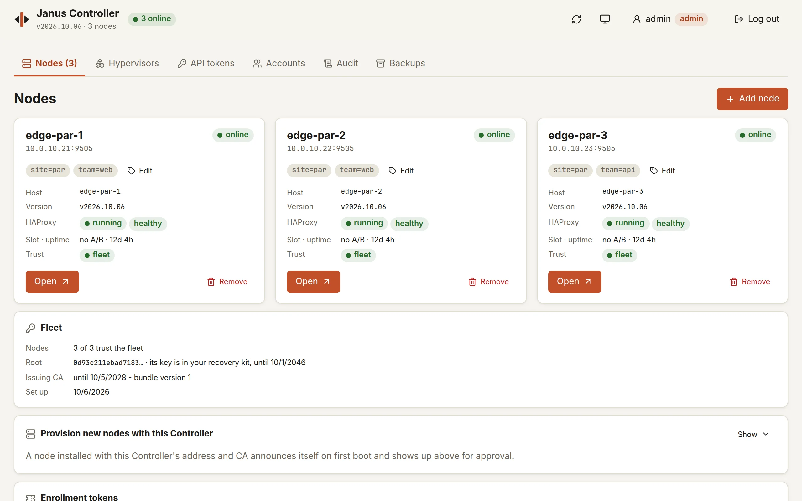
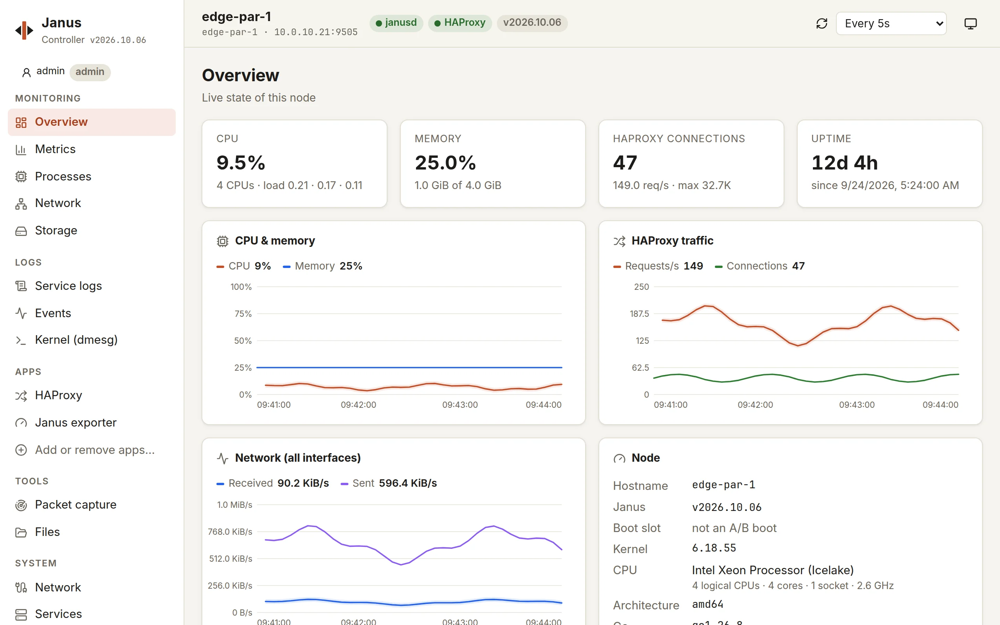
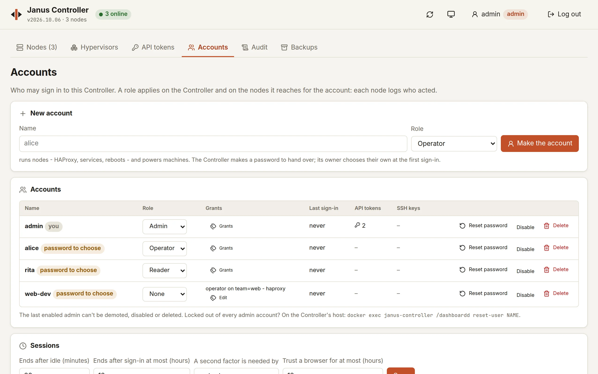
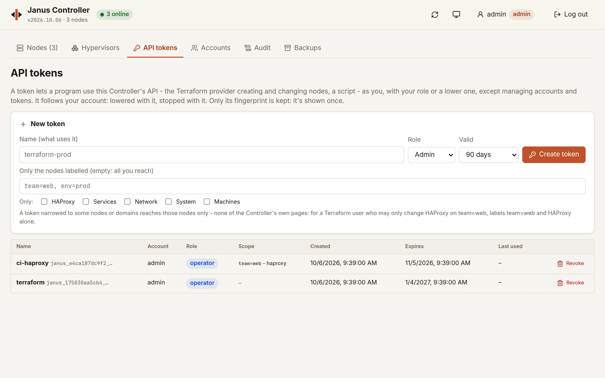

# Janus Controller

A web UI for managing one or more Janus nodes. The node list shows each
node's live status at a glance (online, version and available update,
HAProxy health, boot slot, uptime), handles self-registration approvals,
and provisioning, and says when a newer Controller is out - installing
it in one click with the updater (see [Updating the
Controller](#updating-the-controller)). Each node then has its own page,
with a sidebar:



- **Monitoring** - an overview, live charts (CPU, memory, load, network,
  HAProxy requests/connections/rates; refresh selectable from 1 s to
  30 s or off, history kept while the page is open), processes, network
  interfaces and sockets, mounts, disk I/O and a disk-usage explorer.
- **Logs** - HAProxy's and janusd's output, the node's event log, and the
  kernel log (dmesg), all streamed live, with filter, pause, download.
- **Apps** - HAProxy: status and the full `show stat` table, backends
  (ready/drain/maint per server), a configuration editor (validate, diff
  against the running config, apply seamlessly), maps and ACLs,
  certificates; service start/stop/restart/reload. BGP (bird), VRRP
  (keepalived) and firewall (nftables) pages show whether the node's
  image includes them.
- **Tools** - packet capture to a `.pcap` download (see
  [`docs/packet-capture.md`](../docs/packet-capture.md)), and a
  read-only file browser (preview, download a file or a folder as .tar).
- **System** - services, A/B updates (from a URL or relayed through the
  Controller, with automatic revert), issuing client certificates for
  janusctl (.pfx or PEM), and power: restart janusd (HAProxy keeps
  serving), reboot, shut down, reset - with the page following the node
  until it's back.



A node's page is on the Controller's own address, under
`/nodes/<id>/`, behind your account - no certificate in the browser. The
Controller acts on the node for your account, with its role there
(`os:reader`, `os:operator`, `os:admin`), and the node logs who acted.

Light and dark themes follow the system, or can be chosen per browser.
Design principles and how to verify a UI change:
[`docs/controller-ui.md`](../docs/controller-ui.md).

How it holds together: you sign in to the Controller with an account
([Accounts and roles](#accounts-and-roles)); the Controller reaches each
node over mutual TLS, with a short-lived certificate of its fleet once
the node trusts it ([Securing the fleet](#securing-the-fleet)) - with
the service credential it got when the node was added until then, which
an admin's account only may use. The node checks the role of the
account the Controller acts for, itself.

**Status:** published to Docker Hub as
[`swenske/janus-controller`](https://hub.docker.com/r/swenske/janus-controller)
(`:latest` and per-commit `:<sha>` tags) - `.github/workflows/
image-build.yml`'s own manually-dispatched, self-hosted "Push the
dashboard image to Docker Hub" step builds and pushes it, gated behind
a `DOCKERHUB_TOKEN` repository secret so a fork PR (or a run before
that secret exists) just skips the push, not the build. Building and
running locally, as below, still works exactly the same either way.

## Build

```sh
make dashboard-image      # from the repo root - builds dashboard/Dockerfile
```

This builds a single, self-contained image (`janus-controller`,
`FROM scratch` plus a CA bundle for GitHub release detection - see
`Dockerfile`'s own comment). It does **not** rebuild the frontend from
source: both pages' builds are committed (same convention
`gen/janus/v1alpha1` uses), so this build needs no Node.js toolchain.

`dashboard/frontend` holds both pages: the node list (`index.html`,
`src/App.jsx`, built into `dashboard/backend/static`) and each node's own
page (`node/index.html`, `src/node/`, built with `vite.node.config.js`
into `dashboard/backend/internal/nodeproxy/static`); `src/shared/` is the
theme and UI primitives they share. If you've changed any of it, run
`make dashboard-frontend-build` (`npm ci && npm run build`, both pages)
and commit the result before building the image.

## Run

**Run the container with `--network host`.** It listens on two ports,
and sees the host's own addresses that way: its TLS identity and the
address it suggests for provisioning nodes come from them (with `-p`
mappings instead, set `-advertise-address` - further down).

- **`:8080`** (configurable via `-addr`) - the main UI, **HTTPS only**.
  Behind accounts - the first one, an admin, made on first visit (see
  [Accounts and roles](#accounts-and-roles)).
- **`:8443`** (configurable via `-register-addr`) - where a node
  self-registers (see `internal/pending`); self-announced nodes land in
  a "pending" queue, approved or rejected by hand in the UI, not
  admitted automatically. Nobody is authenticated there, so it's
  bounded: 10 announcements at once per address, then one every 6 s
  (a refused node retries), and 200 waiting for approval - beyond
  that, announcements are refused until some are approved or rejected.
  A node admitted on a token never waits, so the cap doesn't stop it.

```sh
docker run -d \
  --name janus-controller \
  --network host \
  -v janus-controller-data:/data \
  swenske/janus-controller
```

Or with Compose - the recommended way, since the Controller can then
update itself from its page: see [Updating the
Controller](#updating-the-controller) for the complete `compose.yaml`.
The minimal one:

```yaml
services:
  janus-controller:
    image: swenske/janus-controller
    container_name: janus-controller
    network_mode: host
    restart: unless-stopped
    volumes:
      - janus-controller-data:/data

volumes:
  janus-controller-data:
```

(Built and running locally instead of pulled from Docker Hub? Swap the
image for the locally-built `janus-controller` tag - see Build above.)

`-v .../data` is a real requirement, not optional: it's where the node
registry and the dashboard's own TLS identity persist across restarts
(`-data-dir`, default `/data`) - without it, every restart forgets
every registered node and re-issues a new dashboard identity, which
also invalidates the certificate your browser already trusted.

### Who the Controller runs as

Since v2026.10.08 the image runs as user **65532**, not root: with
`--network host`, root in the container would hold the host's network.
What follows from it:

- **The data must be that user's.** A new named volume takes the
  image's `/data` owner by itself. The data of an installation from
  before (root's) is given to 65532 by the updater at the update, as
  its own step - by the updater of v2026.10.07-3 or later: **crossing
  into v2026.10.07-3 is done by hand** (the older updater neither
  gives the data away nor opens its socket to the new user: the new
  version can't start, and is put back), like an installation updated
  by hand or on a bind-mounted directory. With the Controller
  **stopped** - running, it keeps writing files as root - and the
  image has no `chown`, any image with one will do; the master key
  file (`JANUS_CONTROLLER_MASTER_KEY_FILE`, in its own volume the
  updater doesn't mount) is the operator's in every case:

  ```sh
  docker compose stop janus-controller
  docker run --rm -v janus-controller_janus-controller-data:/data \
    -v janus-controller_janus-controller-secrets:/secrets \
    busybox chown -R 65532:65532 /data /secrets/master.key
  # .env: JANUS_CONTROLLER_IMAGE=<the release's controller-image.txt>
  docker compose up -d
  ```

  (Compose names the volumes after the project, by default the
  directory's: `docker volume ls`.) Started on data or a key it can't
  use, the Controller stops at once and says so, with the command.
- **A port below 1024** (`-addr :443`, `JANUS_CONTROLLER_ADDR: ":443"`)
  needs the host to allow it to unprivileged users, since the container
  shares the host's network: `sysctl -w net.ipv4.ip_unprivileged_port_start=443`
  (and in `/etc/sysctl.d/` to keep it). A capability wouldn't reach the
  user; or stay on `:8080` behind your own HAProxy.
- **The updater runs as root** (`user: "0:0"` in its Compose service):
  the Docker socket is root's, and so is giving the data away. The
  `compose.yaml` below has it.
- **A mounted certificate** (`-tls-cert`/`-tls-key`) must be readable
  by 65532 too.

### TLS identity

The Controller has its own self-signed TLS identity
(`loadOrCreateDashboardIdentity`), generated on first run and persisted
to `-data-dir`: what nodes register against (`-register-addr`) and are
provisioned with, and what the page is served with until you give it a
certificate of your own (below) - your browser's one-time trust
click-through survives restarts (passkeys need a certificate the
browser really trusts: give the page one, or trust the Controller's).
Its SAN list covers `localhost`/`127.0.0.1`/`::1`
plus every real address this process can see on its own network
interfaces - with `--network host`, that's the host's actual LAN
address(es) directly, no extra configuration needed. Pass
`-advertise-address YOUR.IP.OR.HOSTNAME` (comma-separated for more than
one; also settable as the `JANUS_CONTROLLER_ADVERTISE_ADDRESS`
environment variable, more natural for a Compose `environment:` block
than overriding the container's command - an explicit flag still wins
if both are given) only if you're *not* using `--network host` and this
process can't otherwise see the address a node or browser will actually
reach it through (Docker bridge networking's own internal IP is a real
example - a self-registering node's plain `net/http` client, unlike a
browser, can't click through a hostname/SAN mismatch, so it would
refuse the handshake outright without this). Only read the first time
the identity is generated - delete
`<data-dir>/dashboard-identity.{crt,key}` and restart to regenerate it
after changing this.

The main UI's own port (`-addr`, default `:8080`) is similarly settable
via the `JANUS_CONTROLLER_ADDR` environment variable (same `":port"`
format) - to run it on the standard HTTPS port instead:

```yaml
services:
  janus-controller:
    image: swenske/janus-controller
    container_name: janus-controller
    network_mode: host
    restart: unless-stopped
    environment:
      JANUS_CONTROLLER_ADDR: ":443"   # needs net.ipv4.ip_unprivileged_port_start=443 on the host
      JANUS_CONTROLLER_ADVERTISE_ADDRESS: "controller.example.com"
    volumes:
      - janus-controller-data:/data

volumes:
  janus-controller-data:
```

### HTTPS certificate

The page (`-addr`) - and janusctl and the Terraform provider, which
reach the same port - can be served with a certificate of your own: a
public one (Let's Encrypt...) or one of your organization's CA. Nodes
keep registering against the Controller's self-signed identity on
`-register-addr` whatever the page uses: a node provisioned with it
(`controller-ca.crt`, the Provision panel) never notices.

- **On the page**: **HTTPS certificate** (an admin, at the bottom of
  the Nodes tab) - paste or load the certificate, its chain and its
  private key (PEM), **Check** what it is (its names, issuer, expiry,
  and a warning when it doesn't name the address the page is opened
  by), then **Serve it**: new connections get it at once. Its key is
  sealed with the master key in `<data-dir>/ui-tls.json` (so in the
  backups); **Back to self-signed** removes it. Refused: an expired or
  not-yet-valid certificate, one not for servers, a key that isn't its,
  an encrypted key, a chain out of order, Ed25519 (browsers refuse it)
  or RSA under 2048 bits. `PUT /api/controller/tls` with an admin API
  token does the same from a script.
- **As files**: mount them in and point `-tls-cert`/`-tls-key` (or
  `JANUS_CONTROLLER_TLS_CERT`/`JANUS_CONTROLLER_TLS_KEY`) at them - both
  or neither. They win over an uploaded one, and are read again within
  30 seconds of changing: a renewal (certbot...) needs no restart.

```sh
docker run -d \
  --name janus-controller \
  --network host \
  -v janus-controller-data:/data \
  -v /path/to/certs:/certs:ro \
  swenske/janus-controller -tls-cert /certs/fullchain.pem -tls-key /certs/privkey.pem
```

janusctl then takes the page's certificate with `janusctl login` alone
when the machine trusts its CA (the system's trust store - renewals go
unnoticed), or with `-controller-ca` and the CA's certificate; a
context that pinned the self-signed certificate is told to sign in
again. Terraform: `ca_cert` is that CA's certificate, or nothing for a
public one.

Before this release, `-tls-cert` also replaced the registration port's
certificate: a node provisioned since with that certificate as its
`controller-ca.crt` and not registered yet needs the Controller's own
(`controller-ca.crt` from the Provision panel) - or the fleet root,
which it checks first.

### Adding a node

Open `https://<host>:8080/` (note **https** - the click-through warning
on first visit is expected with the default self-signed certificate)
and add a node: you'll need its display name, its gRPC address
(`ip:9505` by default), its `ca.crt` (public, not sensitive), and a
client credential that already has `os:admin` on that node - either the
one `janusd` printed to its console on first boot, or one you generated
yourself via `janusctl pki generate-client-config`. That credential is
used exactly once, to call `GenerateClientConfiguration` and obtain a
fresh service credential for the dashboard's own use - it is never
written to disk itself (see the architecture note above).

A node can also register itself with this Controller automatically at
first boot instead, if it was provisioned with `janusctl lifecycle
install`'s `-controller-address`/`-controller-ca` flags - it then shows
up in a "pending" queue for you to approve or reject, rather than being
added by hand. The "Provision a new node" panel in the UI has the exact
address/CA certificate/command to use for this, pre-filled from this
Controller's own configuration (double-check the suggested address
against your real network before using it - this process can't always
tell what address a node will actually be able to reach it at, most
notably under Docker bridge networking, see the `-advertise-address`
note above).

For a batch - a rack, bare metal -, an admin makes an **enrollment
token** under that panel: a name, how many nodes, how long, and labels.
Each node provisioned with it (`-registration-token` on `janusctl
lifecycle install` or `image seed-controller`, or `registration_token`
in NoCloud user-data - the panel puts it in its commands) is admitted at
once, with those labels, without the approval step; one past its uses,
its date, or its revocation waits for approval like any other. Only its
SHA-256 is kept (`enroll-tokens.json`).

### Securing the fleet

Until it has a fleet, the Controller reaches each node with a service
credential it got when the node was added, kept for good. The **Secure
your fleet** card on the main page replaces them, in three steps:

1. **Create the fleet**: its root certificate authority, an issuing CA
   the Controller keeps, and a recovery kit - the root's key, encrypted
   with a passphrase shown this once.
2. **Store the kit and its passphrase** - a password manager is ideal:
   the kit is text (an [age](https://age-encryption.org) file, `age -d`
   opens it), a secure note holds it.
3. **Give them back**: once they open, the root's key is deleted from
   the Controller, and every node is brought to trust the fleet - the
   Controller then reaches it with certificates of its own, valid a day,
   acting for whoever opened the node's page (the node logs it), and
   deletes the node's service credential. Nothing changes for the nodes
   before this step.

A node too old to trust a fleet (from before v2026.10.04) says **needs
an update** on its card: the Controller keeps reaching it as before,
until it's updated - so update the nodes first, then create the fleet,
and every node takes it in the same minute. The kit
and its passphrase are needed again only to renew the fleet's keys, or
to recover a lost Controller: from a backup ([Backups](#backups)), or,
with none, from janusctl alone - `janusctl fleet recover -kit KIT` then
`janusctl fleet adopt ... -kit KIT` per node brings the nodes under
janusctl, without a Controller
([docs/fleet-without-controller.md](../docs/fleet-without-controller.md)).

The issuing CA's key is sealed with the Controller's master key,
`JANUS_CONTROLLER_MASTER_KEY_FILE`: keep that file outside the data
directory, as the Compose setup below does - otherwise a copy of the
data holds both, and the Controller says so on its page.

### Creating nodes on a hypervisor

Given a libvirt/KVM host (the **Hypervisors** tab), the Controller
creates nodes itself: the virtual machine, its image, its network, and
a registration token that gets the node admitted without approval - and
it powers them, shows their console and destroys them. It only ever
acts on the machines it created. Preparing the host (a dedicated SSH
account, a storage pool, a polkit policy) and the API:
[docs/hypervisors.md](../docs/hypervisors.md).

### Accounts and roles

The first visit makes the first account, an admin. An admin makes the
others on the **Accounts** tab, each with a role:

| Role | On the Controller | On nodes, through it |
|---|---|---|
| **reader** | sees everything, changes nothing | `os:reader` |
| **operator** | + powers machines and opens their consoles | `os:operator`: HAProxy, services, reboots |
| **admin** | everything: accounts, the fleet, hypervisors, machines, approvals, updates, the audit | `os:admin` |



The Controller makes a new account's password, shown once to hand over;
its owner chooses their own at the first sign-in. **Reset password**
does the same for an account and ends its sessions. The last enabled
admin can't be demoted, disabled or deleted. A Controller from before
accounts had one admin password: it's the account `admin`'s now, and
its API tokens are admin's.

**Scopes**: nodes carry **labels** (`team=web`, `env=prod` - an admin
sets them on the node's card), and an account can have **grants** - a
role on the nodes whose labels match, narrowed to some **domains** if
you like:

| Domain | What it is |
|---|---|
| `haproxy` | HAProxy's configuration, files, maps, ACLs, certificates, Let's Encrypt, servers' state, reloads |
| `services` | services, reboots, their logs |
| `network` | network, firewall, VRRP, BGP, Consul |
| `system` | updates, access and certificates, files, packet capture, the exporters' settings, reset |
| `machines` | a machine's power and console (the Controller's own) |

Reading a node's state comes with any grant on it. An account can have
a role over everything, grants, or both - its strongest permission on a
node wins; with role **none**, it reaches only its grants' nodes, sees
no other node, and none of the Controller's own pages (hypervisors,
accounts, the fleet). Each call the Controller relays goes with the
permission that allows it, or is refused before it leaves; the node
checks it again (`janus-as-domains`), and logs it: `tf (os:operator;
haproxy) via janus-controller`. janusctl's certificate carries the
account's role over everything, never a grant: an account with none
gets none yet.

An **API token** can be narrowed further: a role at most, a selector
(only the nodes with those labels), domains. Such a scoped token reaches
its nodes and nothing of the Controller's own - a Terraform user's
token that may only change HAProxy on `team=web`: role operator, labels
`team=web`, domain `haproxy`.

Sessions end after 30 minutes nobody touched the page, and 12 hours
after the sign-in at most - both on the **Accounts** tab. A page left
open refreshing itself doesn't count as use.

**A second factor** - an authenticator app's code (TOTP), or a passkey
or security key (WebAuthn) - finishes every sign-in of an account that
has one; ten recovery codes come with the first, each good once. The
policy (**Accounts** tab, or the first run's check box) says who must
have one: admins by default, everyone, or nobody. Such an account
without any sets one up at its next sign-in, before anything else -
including the admin of a Controller updated from before second factors.
The authenticator secrets are sealed with the Controller's master key;
an admin's **Reset 2FA** takes an account's factors away (a lost phone).
Passkeys need the Controller opened by its name, with a certificate the
browser trusts - a self-signed one clicked through isn't: browsers
refuse passkeys there, and an authenticator app works anywhere.

**Trust this browser**: when giving the second factor, a box keeps it
from being asked again in that browser for 12 hours (**Accounts** tab:
*Trust a browser for at most (hours)*, up to 30 days, 0 to always ask)
- signing out and in again, or an idle session ending, then takes the
password only. The browser keeps a secret in a cookie (HttpOnly,
Secure, sent to `/api/auth/` only), the account its SHA-256. Your
account's dialog lists your trusted browsers and forgets any of them; a
password change, a **Reset 2FA**, a disabled account or a shorter
policy forgets them too. A sign-in a trusted browser skipped the factor
in gives it once more to add an SSH key (a key outlives the browser's
trust). The audit shows such a sign-in `via trusted browser`.

The **Audit** tab is every change made on the Controller - from its
pages or with an API token - and every sign-in, failed or not, with who
made it (`<data-dir>/audit.jsonl`, and the container's log). What the
Controller does on a node, the node logs too, with the same name.

**Locked out of every admin account?** On the Controller's host:

```sh
docker exec janus-controller /dashboardd reset-user admin
```

prints a new password for that account - to change at the next sign-in
-, takes its second factors away, enables it, and makes it an admin if
it doesn't exist. The running
Controller takes it at once.

### janusctl

`janusctl login` signs in to the Controller with an SSH key of your
account - or, in CI, an API token (`JANUS_TOKEN`) - and gets a
certificate of its fleet and its nodes; janusctl then reaches the nodes
directly, each checking the certificate's role itself
([janusctl](../docs/janusctl.md#using-janusctl)). The fleet must be set up.
An account whose permissions differ from node to node - grants, no role
over everything, a token narrowed to some nodes or domains, an SSH key
or an approval with a lower role on top - gets a scoped certificate:
what it may do on each node it reaches, those nodes named by their CA's
key, each node checking its own entry; and only those nodes in its
inventory. One that reaches no node gets none (403).

Your SSH keys are in your account's dialog (**SSH keys for janusctl**):
adding one needs a sign-in that gave a second factor - the key then
signs janusctl in alone, for 12 hours at a time. A key can carry a
lower role than the account, and expire; removing it stops new
sign-ins. An admin sees each account's keys on **Accounts** and can
revoke them all at once - a lost laptop: the certificates they already
got end within 12 hours (disable the account to cut them sooner).

Without an SSH key, janusctl signs in through this page: `janusctl
login -controller ...` opens it - you approve a certificate for the key
janusctl made, shown by its fingerprint, and the page hands it back to
janusctl on `127.0.0.1` -, or `janusctl login -device` shows a code to
enter on the page (**/#/cli-device**) from another machine. Only approve
a code you started yourself.

The API behind it: `POST /api/cli/grant` (the page, from a session:
`{key_fingerprint, role}` → a code for janusctl's listener, good once
for two minutes and for that key only) and `POST /api/cli/exchange`
(`{code, csr_pem}`); `POST /api/cli/device` (`{csr_pem}` → a code to
type, one to poll with), `GET /api/cli/device/{code}` and `POST
.../approve` / `.../deny` (the page), `POST /api/cli/device/token`
(janusctl's poll: 428 while pending); `POST /api/cli/challenge` then `POST
/api/cli/ssh-login` (the challenge signed with the key, SSHSIG namespace
`janus-login`, for the Controller's certificate fingerprint → a
certificate for the key itself, and the nodes); `POST
/api/cli/certificate` (an API token or a session: `{csr_pem}` → the
certificate and the issuing CA, its role and end); `GET
/api/cli/inventory`; `GET/POST/DELETE /api/auth/ssh-keys` (your own,
from a session).

### Backups

The **Backups** tab (admins) backs the Controller up: everything it
keeps - accounts, nodes, the fleet, hypervisors, machines, the audit,
its master key - and each node's configuration read through its API
(HAProxy's configuration, maps and files, network, firewall, VRRP, BGP,
Consul, Let's Encrypt, the exporters), never a node's private keys: the
API doesn't hand them out, by design - a certificate you uploaded comes
back from where you keep it, Let's Encrypt's are issued again.

1. **Make the backup kit**: the age key the backups are encrypted to,
   in a kit encrypted with a passphrase - store both together (a
   password manager's secure note), give them back to prove it, like
   the fleet's recovery kit. The Controller keeps only the public half:
   it writes backups and can't read them. Admins' SSH or age public keys
   can decrypt them too (optional).
2. **Where and when**: an S3 bucket - AWS, MinIO, Garage, Ceph,
   Backblaze B2, Cloudflare R2... - once a day by default, the last 30
   kept. **Back up now**, or **Download a backup** without a bucket. A
   failed backup is tried again an hour later; until one works - or
   when none did for twice the interval - admins see **Backup failing**
   (or **late**) at the top of the Controller.

With **Backblaze B2** (10 GB free - a backup is tens of KiB): a private
bucket with Object Lock (a default retention of 30 days) and a lifecycle
rule that deletes files after 31; an application key for that bucket
only, with `listBuckets`, `listFiles` and `writeFiles` - no
`readFiles`, no `deleteFiles`; then endpoint
`https://s3.<region>.backblazeb2.com` (e.g. `s3.eu-central-003...`),
region `eu-central-003`, path-style. A restore needs a key that may
read (`readFiles`, `listFiles`). Synology's Cloud Sync, download-only
with such a key, keeps a copy on a NAS.

Each backup is one `.janusbackup` object: its manifest, signed by the
Controller (Ed25519 - age alone doesn't say who encrypted a file), then
the encrypted archive. Give the Controller credentials that may only
write, and turn the bucket's versioning or Object Lock on: whoever took
the Controller could then stop the backups, not erase the past ones;
without the right to delete, the Controller leaves expiry to the
bucket's own rules.

**Restoring**: on a new Controller, its first page - **Restore a backup
instead**: the bucket (or a file), the backup kit and its passphrase.
It starts again as the Controller backed up - its accounts, second
factors, fleet and nodes: the nodes keep trusting it. Or on the host,
with the Controller stopped:

```sh
docker run --rm -it -v janus-controller-data:/data -v ./backup:/b swenske/janus-controller \
  restore -kit /b/janus-backup-kit.age /b/janus-controller-....janusbackup
# it runs as user 65532: ./backup must be readable by it (or add --user 0:0)
# with an admin's key instead of the kit (the signing key is on the Backups tab):
#   restore -identity /b/id_ed25519 -signing-key BASE64 /b/....janusbackup
```

The passphrase is asked, or read from `JANUS_BACKUP_PASSPHRASE`; the
master key goes to `JANUS_CONTROLLER_MASTER_KEY_FILE` (or the data
directory). A changed byte, or a backup another Controller signed, is
refused.

| If someone gets... | they have |
|---|---|
| the bucket | encrypted backups: nothing without the kit and its passphrase |
| the kit, not its passphrase | an encrypted file |
| the Controller, running | what the Controller can do while they hold it - it can't read past backups, and versioning or Object Lock keeps them |
| the kit and its passphrase | the backups: keep them like the fleet's recovery kit |

### API tokens and Terraform

A program uses the Controller's API with an API token (the **API tokens**
tab: shown once, revocable) sent as `Authorization: Bearer`. A token is
its account's, with the account's role or a lower one: demoted with the
account, stopped with it. Tokens manage neither accounts nor tokens. The
Janus Terraform provider is one: it creates, changes and destroys the
Controller's nodes as code ([docs/terraform.md](../docs/terraform.md)).



## Updating the Controller

The main page says when a newer Janus release exists (the version this
Controller runs is under its title). With **janus-controller-updater**
running next to it, one click installs that release - after you confirm
- and if the new version doesn't come up, the previous one is put back
by itself, with its data.

Why a second container: updating the Controller means replacing its own
container, which needs the Docker socket - and access to the Docker
socket is root on the host. The Controller already holds a credential
for every node; it doesn't get the host too. The updater has the socket,
no network at all, and does exactly one thing: move the Controller's
Compose service to the image of a published release. It ships in the
same image (its own entrypoint), with Docker Compose's standalone binary.

### The Compose setup

Put this `compose.yaml` in its own directory - `/opt/janus-controller`
here; **use your directory's real path in place of
`/opt/janus-controller`, on both sides of its line**:

```yaml title="examples/compose/compose.yaml"
# /opt/janus-controller/compose.yaml
services:
  janus-controller:
    # The image comes from .env: the updater sets JANUS_CONTROLLER_IMAGE
    # there to the release it installs, pinned to its digest. Without
    # the variable, :latest.
    image: ${JANUS_CONTROLLER_IMAGE:-swenske/janus-controller:latest}
    container_name: janus-controller
    network_mode: host
    restart: unless-stopped
    # The Controller runs as user 65532 (the image's USER) and writes
    # only under /data (and the updater's socket directory): the rest of
    # its image stays read-only, it keeps no capability, and nothing it
    # starts gains any. Its ports are above 1024: a `-addr :443` needs
    # the host's `net.ipv4.ip_unprivileged_port_start=443` (the container
    # shares the host's network, so the host's setting) - a capability
    # wouldn't reach an unprivileged user.
    read_only: true
    cap_drop: [ALL]
    security_opt: [no-new-privileges:true]
    environment:
      # The master key sealing the fleet's issuing key: outside the data
      # volume, so a copy of the data (its backups) holds nothing usable.
      JANUS_CONTROLLER_MASTER_KEY_FILE: /secrets/master.key
    volumes:
      - janus-controller-data:/data
      - janus-controller-secrets:/secrets
      # Where the updater listens: the Controller asks it for an update
      # here, and tells it once started (no word from a new version
      # within 2 minutes, and the updater rolls back).
      - janus-controller-updater:/run/janus-updater

  janus-controller-updater:
    image: ${JANUS_CONTROLLER_IMAGE:-swenske/janus-controller:latest}
    container_name: janus-controller-updater
    entrypoint: ["/janus-controller-updater"]
    # Talks to the Docker daemon over its socket only: no network.
    network_mode: none
    restart: unless-stopped
    # Root, unlike the Controller: the Docker socket is root on the host
    # already (by design, it recreates the Controller's container), and
    # it gives the data to the Controller's user at an update. It at
    # least keeps no capability of its own and nothing it starts gains
    # any.
    user: "0:0"
    cap_drop: [ALL]
    security_opt: [no-new-privileges:true]
    volumes:
      # To pull the new image and recreate the Controller's container.
      - /var/run/docker.sock:/var/run/docker.sock
      # This directory, at the SAME path: the updater runs docker compose
      # on this compose.yaml and rewrites .env next to it.
      - /opt/janus-controller:/opt/janus-controller
      # The Controller's data, to back it up before an update and put it
      # back if the update is rolled back.
      - janus-controller-data:/data
      - janus-controller-updater:/run/janus-updater
      # Its own state: the last update and the backup it made.
      - janus-controller-updater-state:/var/lib/janus-updater

volumes:
  janus-controller-data:
  janus-controller-secrets:
  janus-controller-updater:
  janus-controller-updater-state:
```

Then, in that directory:

```sh
docker compose up -d
```

`.env` is optional at first - without it, both containers run
`swenske/janus-controller:latest`. Keep `.env` next to `compose.yaml`
(Compose's default place): that's the file the updater edits. It only
ever touches the `JANUS_CONTROLLER_IMAGE=` line - other variables and
comments stay as they are, and the file keeps its owner and mode.

**Coming from the minimal setup above**: edit the `compose.yaml` you
already have, **in the directory it's in** - Compose names volumes
after the project, by default that directory's name, so the same file
moved elsewhere would start on new, empty volumes. Change the
Controller's `image:` line, add its second volume, add the
`janus-controller-updater` service (with *that* directory on its
directory line) and the two new volumes, then `docker compose pull &&
docker compose up -d`. The node registry, the accounts and the
TLS identity are in the data volume: unchanged.

The page then shows, under an available update, either an **Update to
vX** button, or what keeps the updater from updating - each problem
with what to do, for example:

- *the updater can't see /opt/janus-controller/compose.yaml - mount the
  Compose directory at the same path* - the directory line is missing,
  or its two sides differ;
- *can't reach Docker at /var/run/docker.sock* - the socket line is
  missing (with rootless Docker, mount your user's socket, e.g.
  `/run/user/1000/docker.sock:/var/run/docker.sock`);
- *service janus-controller's image doesn't come from
  JANUS_CONTROLLER_IMAGE* - the `image:` line still names a fixed image;
- *the Controller must mount the updater's socket volume* - the
  Controller's `janus-controller-updater:/run/janus-updater` line is
  missing;
- *the updater needs the Controller's data volume* - the updater's
  `janus-controller-data:/data` line is missing, or names another volume.

The updater's own log (`docker logs janus-controller-updater`) says the
same at startup, and logs every update step.

### What an update does

From the page, only the newest release can be installed: the Controller
gives the updater that version and the image its GitHub release names
(`controller-image.txt`: `swenske/janus-controller:vX@sha256:...`, the
exact image built and tested for the release - older releases: the
`vX` tag). The updater checks it's that repository and that version,
then:

1. **pulls** the image - if that fails, nothing has changed;
2. **stops** the Controller (`docker compose stop janus-controller`);
3. **backs up** the data volume and `.env` into its state volume
   (`backup/`, replacing the backup of the previous update);
4. **gives the data** to the user the new image runs as (65532 since
   v2026.10.08 - [Who the Controller runs as](#who-the-controller-runs-as)),
   when it isn't already;
5. **writes** `JANUS_CONTROLLER_IMAGE=<image>` into `.env` and runs
   `docker compose up -d janus-controller` - exactly what you'd do by
   hand;
6. **waits** for the new Controller to say it has started, and to still
   run 10 seconds later.

If step 5 or 6 fails, it **rolls back**: stops the new Controller, puts
the data and `.env` back (root's again, what the previous version ran
as), starts the previous version, and waits for it the same way.

The page follows the update: the Controller restarts, so you're asked to
sign in again (sessions don't survive a restart), then the page says how
it ended - updated, or rolled back and why - with the updater's log.
Nodes keep running throughout; their pages reconnect by themselves.

From then on, the Controller's version is the `JANUS_CONTROLLER_IMAGE`
line in `.env`: `docker compose pull` no longer moves it to `:latest`
(remove the line for that). The updater itself still runs the image it
started with - the next `docker compose up -d` gives it the new one,
which is harmless at any time.

### When an update fails

- **Rolled back** - nothing to do: the previous version runs, with its
  data. The page shows why (a new version that didn't start within 2
  minutes, or one that stopped right after starting), and the updater's
  log has the details.
- **Rollback failed** - the previous version didn't come back either,
  which needs a hand. Its data and `.env` are in the updater's state
  volume, under `backup/` (`data/`, `env`, `info.json` with the image it
  ran). Volume names are prefixed with the Compose project's name, by
  default its directory's (`docker volume ls | grep janus-controller`).
  To put it back by hand, in the Compose directory:

  ```sh
  docker compose stop janus-controller
  docker run --rm -v janus-controller_janus-controller-data:/data \
    -v janus-controller_janus-controller-updater-state:/state \
    busybox sh -c 'find /data -mindepth 1 -delete && cp -a /state/backup/data/. /data/'
  docker run --rm -v janus-controller_janus-controller-updater-state:/state \
    busybox cat /state/backup/env > .env   # if the backup has one
  docker compose up -d
  ```

- **Interrupted** - the updater stopped mid-update (the host rebooted,
  say). Check which version runs (`docker compose ps`); the backup above
  is the state from before the update.

### Updating by hand

Without the updater, with the `compose.yaml` above: set the line the
page shows - the release's image, also in its `controller-image.txt` -
in `.env`, then `docker compose up -d`:

```sh
echo 'JANUS_CONTROLLER_IMAGE=swenske/janus-controller:vX' >> .env  # or edit the existing line
docker compose up -d
```

Crossing v2026.10.08 by hand (the image runs as 65532 from there), give
the data to that user first - [Who the Controller runs
as](#who-the-controller-runs-as); the updater does it by itself.

### Settings

Environment variables, all optional:

| Variable | Container | Default | What |
|---|---|---|---|
| `JANUS_CONTROLLER_MASTER_KEY_FILE` | Controller | `<data-dir>/master.key` | the master key sealing the fleet's issuing key - made there the first time; keep it outside the data directory |
| `JANUS_CONTROLLER_UPDATER_SOCKET` | Controller | `/run/janus-updater/updater.sock` | where to find the updater (empty: never) |
| `JANUS_CONTROLLER_TLS_CERT`, `JANUS_CONTROLLER_TLS_KEY` | Controller | - | the page's own certificate (then its chain) and key as files, read again when they change ([HTTPS certificate](#https-certificate)) |
| `JANUS_UPDATER_SERVICE` | updater | `janus-controller` | the Controller's service name in `compose.yaml` |
| `JANUS_UPDATER_VARIABLE` | updater | `JANUS_CONTROLLER_IMAGE` | the `.env` variable its `image:` comes from |
| `JANUS_UPDATER_START_TIMEOUT` | updater | `2m` | how long a new version has to start |
| `JANUS_UPDATER_STABLE` | updater | `10s` | how long it must then keep running |
| `JANUS_UPDATER_REPOSITORY` | updater | `swenske/janus-controller` | the only repository it installs from (a mirror) |
| `JANUS_UPDATER_DOCKER_SOCKET` | updater | `/var/run/docker.sock` | the Docker socket, inside the container |

`hack/controller-self-update-test.sh` (`make
controller-self-update-test`, run by `image-build.yml` before anything
is published) proves this setup with real Docker Compose: the updater
explaining a missing mount, an update that works (data, TLS identity,
password and `.env`'s other lines kept), and one whose new version never
starts, rolled back by itself.

## Build (backend only, no image)

For local development without Docker:

```sh
make dashboard-build   # the frontend rebuilt (Node.js 24), then bin/dashboardd
make dashboard-bin     # or bin/dashboardd alone, from the committed frontend - Go only
./bin/dashboardd -addr :8080 -data-dir ./dashboard-data
```

Open `https://localhost:8080/` (not `http://`) - a self-signed certificate is generated into `./dashboard-data` on first run.

## Verification

`hack/qemu-dashboard-test.sh` (`make qemu-dashboard-test`) drives the
whole add/list/relay/mTLS-gate/delete/restart-persistence flow, plus
the ops/config relay (`ShowInfo`/`GetConfig`/`ApplyConfig`/`BackendList`/
maps/ACLs/certificates), against a real booted node - not a mock. The
Docker image itself is verified by building it and running a real
container against it (`docker build` + `docker run` + a real `curl`),
same discipline as everything else in this project.
