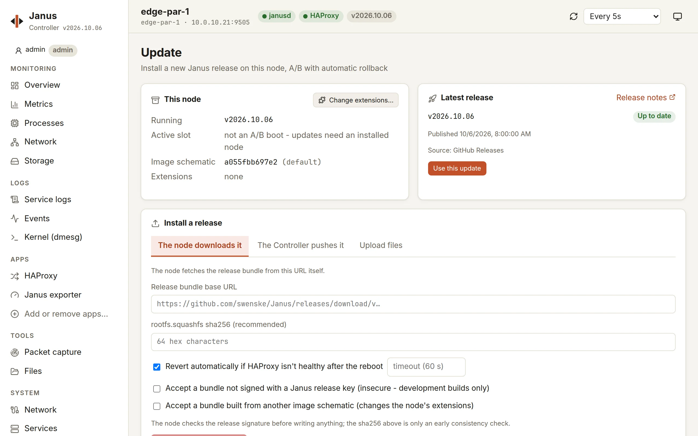

# Updating nodes

A node updates as a whole: the next release's system is written to its
idle slot, checked, and booted - its configuration kept - and the node
goes back to the previous release by itself if HAProxy doesn't come back
healthy. How it works: [lifecycle](../private-cloud/lifecycle.md).

## When there's an update

The Controller checks for new releases and shows, on each node's card,
whether an update is available - with a 🔒 when it fixes a
vulnerability on that node (an extension's fix only for the nodes that
have it). Only the latest release is supported: install security updates
promptly ([security policy](../../SECURITY.md)).

## From the Controller

On the node's page, **System › Update**:



1. It shows the node's release, slot and extensions, and the release to
   install - from its GitHub release, or built by the image factory for
   the node's extensions.
2. **Install a release**, in one of three ways:
   - **the node downloads it** - from GitHub or the image factory;
   - **the Controller pushes it** - for a node that can't reach the
     internet: the Controller downloads the bundle and streams it to the
     node;
   - **upload files** - a bundle from your computer, through the
     Controller.
3. Keep **automatic revert** on: the node confirms itself only once
   HAProxy answers healthily after the reboot, and goes back otherwise.
4. **Install and reboot**: the page follows the node through its reboot
   until it's back, on its new slot.

Update the nodes of a pair one at a time: before rebooting, a node gives
its virtual IP or its BGP route up, so the other one serves alone for
the minute it takes.

**Changing the image** - its extensions, its HAProxy branch, its kernel
track - is an update too: **Change the image…** on the same page asks
the image factory for the newest release built with what you pick, and
the installation confirms what the node gains and loses ([images and
extensions](../image-factory.md#updates-keep-the-schematic)). Another
HAProxy branch may refuse the node's configuration: check it against
that branch first ([what differs](../haproxy-config.md#haproxy-branches));
the automatic revert stays on for such an update. A node pinned to a
HAProxy branch shows when its upstream support ends, and when the
releases stopped offering it (no newer update will come).

## With janusctl

```sh
v=v2026.10.05-5
janusctl -n lb1 lifecycle upgrade -wait-for-health \
  https://github.com/swenske/Janus/releases/download/$v/
janusctl -n lb1 version           # the release now running, and its slot
```

- `-wait-for-health` is the automatic revert; `-health-timeout` how long
  HAProxy has to be healthy.
- A node with extensions takes its schematic's bundle - the URL the
  [image factory](../image-factory.md#getting-an-image-janussw-serversnet)
  gives for it - and refuses another schematic's unless
  `-allow-schematic-change`.
- A node that can't reach the URL: `janusctl lifecycle upload-release
  DIR` streams a bundle from where `janusctl` runs, then `upgrade` takes
  the directory it prints.
- `-kexec` reboots into the new release without going through the
  firmware: the running kernel jumps straight into the new one, in
  seconds, where a server's POST takes a minute. The same flag on
  `janusctl system reboot`. It is opt-in: a driver left in an odd state
  by the running kernel is kexec's known risk, which a firmware reboot
  never has - try it on a node you can reach otherwise, then make it
  your habit where it works. With Secure Boot on, only a release signed
  by Janus can be kexec'd, as the firmware would only boot that; an
  update that can't be kexec'd reboots through the firmware and says so.
  A revert always goes through the firmware. Known not to work: a
  virtual machine whose UEFI variables are served from SMM (OVMF's
  Secure Boot-capable firmware - what Proxmox VE gives a q35 machine
  with an EFI disk, and libvirt a machine with `secure-boot` enabled):
  the kernel jumped into crashes at once and the firmware boots the
  node instead - slower, not lost. The Controller's own libvirt
  machines (Secure Boot off) and VMs on the plain OVMF are fine; bare
  metal is untried.

## Going back

`janusctl -n lb1 lifecycle rollback`: the node reboots into its other
slot - the release it ran before, with the same configuration.

## When an update reverted

The node is back on its previous release, serving as before. Its event
log and janusd's output say why:

```sh
janusctl -n lb1 system events
janusctl -n lb1 system logs -n 100 janusd
```

The usual cause is a HAProxy configuration the new release refuses - a
keyword its TLS library doesn't support, say ([TLS:
AWS-LC](../haproxy-config.md#tls-aws-lc)): fix it on the node, then
update again.

## The Controller itself

One click on the Controller's page, with its updater running next to it
- and if the new version doesn't come up, the previous one comes back
with its data: [updating the Controller](../../dashboard/README.md#updating-the-controller).
