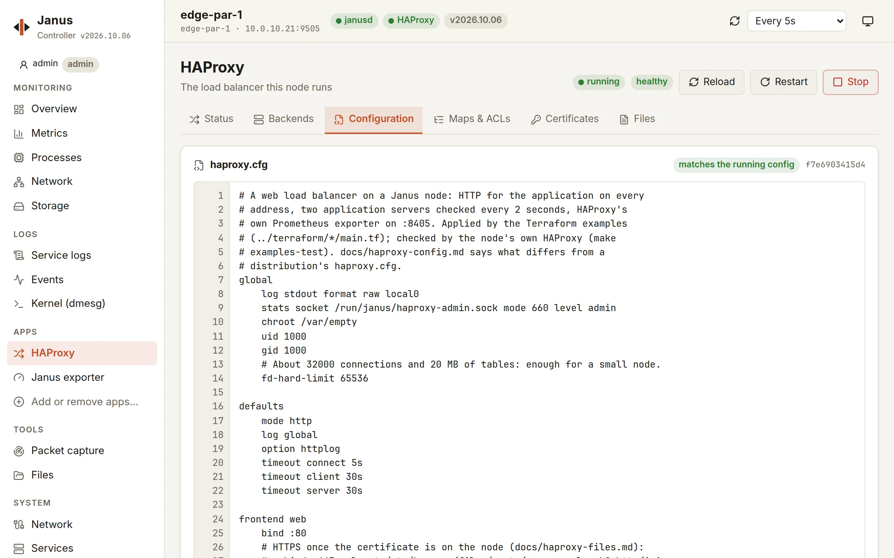
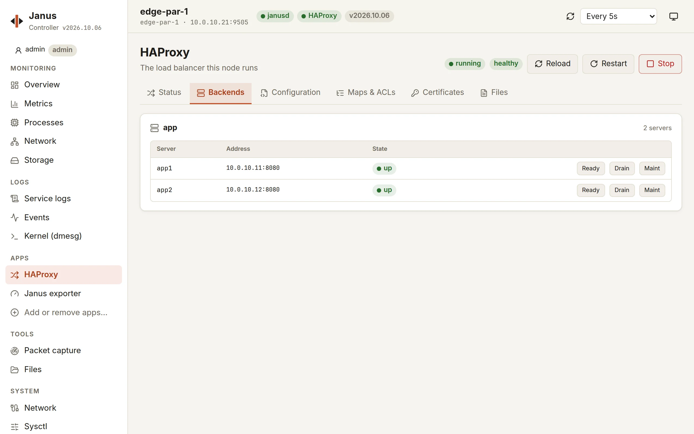

# Bringing your haproxy.cfg to a Janus node

A Janus node runs a stock HAProxy (an LTS branch - 3.4 unless its image
picks [another](#haproxy-branches) - with AWS-LC as its TLS library and
the Prometheus exporter built in) under `janusd`: an existing
configuration mostly works as is.
What differs is the machine around it - no syslog, no users, no shell to
copy files with. This is what to change, then apply it with `janusctl
haproxy apply-config FILE` or the Controller's **HAProxy › Configuration**.

Its **Backends** tab shows each server's state, and sets it - ready,
drain, maintenance - at runtime:

## The global section

| On a distribution | On a Janus node | Why |
|---|---|---|
| `log /dev/log local0` | `log stdout format raw local0` | No syslog daemon. janusd keeps HAProxy's output: `janusctl system logs haproxy`, the Controller's logs page |
| `user haproxy` / `group haproxy` | `uid 1000` / `gid 1000` | No `/etc/passwd` to resolve names against |
| `chroot /var/lib/haproxy` | `chroot /var/empty` | The empty directory janusd prepares |
| `daemon` | (remove it) | janusd supervises HAProxy in the foreground |
| `stats socket /run/haproxy/admin.sock ...` | `stats socket /run/janus/haproxy-admin.sock mode 660 level admin` | janusd's own runtime API goes through this socket - it must be there, at this path, with `level admin` |
| `crt-base`, `ca-base` | (remove, use full paths) | Your files live in `/etc/haproxy/files/` |
| `ssl-dh-param-file` | (remove it) | AWS-LC has no DHE ciphers - see [TLS](#tls-aws-lc) |

The node checks these before `haproxy -c`, and refuses a configuration
with the line that's wrong: `chroot /var/empty`, `uid 1000`, `gid 1000`
and janusd's `stats socket` line are required, exactly; no other `stats
socket` (an administration socket on the network, say), and no `daemon`,
`master-worker`, `external-check`, `insecure-fork-wanted`,
`set-dumpable`, `setenv`/`presetenv`/`resetenv`/`unsetenv` or `program`
section - HAProxy on a node runs no program and keeps janusd's
environment. The rest of the global section is yours: `log`, `maxconn`,
`tune.*`, `ssl-default-*`, threads...

## TLS: AWS-LC

HAProxy is built against [AWS-LC](https://github.com/aws/aws-lc) rather
than OpenSSL 3, whose locking slows HAProxy down as soon as several
threads handshake - HAProxy's own recommendation. Measured with HAProxy
on 1 to 4 threads: 1.4 to 7 times more TLS handshakes per second than
with OpenSSL 3.5, the gap growing with the threads. Certificates and
crt-lists (runtime updates included), client-certificate verification
with CRLs, SNI, ALPN, TLS 1.2/1.3, X25519MLKEM768 and the TLS sample
fetches behave as with OpenSSL - except `ssl_fc_curve`, which names the
NIST curves `prime256v1`/`secp384r1` (OpenSSL: `SECP256R1`/`SECP384R1`),
and the default TLS 1.2 preference, AES-128-GCM before AES-256-GCM. What
AWS-LC doesn't have, and the node refuses:

| Keyword | Do instead |
|---|---|
| `ssl-dh-param-file`, `tune.ssl.default-dh-param` (ignored, with a warning) | Remove: no DHE |
| A `ciphers`/`ssl-default-*-ciphers` list made only of `DHE-*` ciphers | Add ECDHE ciphers - in a mixed list (Mozilla's intermediate profile) the DHE ones are just skipped |
| `X448`, `ffdhe*`, `brainpool*` in `curves`/`ssl-default-*-curves` | Remove them from the list (the whole list is refused otherwise) |
| `client-sigalgs`, `ssl-default-bind-client-sigalgs`, `ssl-default-server-client-sigalgs` | Remove (`sigalgs` works) |
| `ssl-security-level` | Remove; restrict with `ssl-min-ver`, `ciphers` and `curves` |
| `ssl-mode-async`, `ssl-engine`, `ssl-provider`, `ssl-propquery` | Remove: no engines or OpenSSL 3 providers |

Fix such a configuration before updating a node that runs it on an
OpenSSL release. Updated from the Controller (automatic revert, on by
default) or with `janusctl lifecycle upgrade -wait-for-health`, a node
whose HAProxy refuses its configuration goes back to its previous
version on its own.

## HAProxy branches

An image is built with one HAProxy LTS branch - 3.4, 3.2 or 3.0, which its
schematic picks ([image-factory.md](image-factory.md#haproxy-branches-and-kernel-tracks));
`janusctl version` says which a node runs. Every branch is built the same
way, against the same AWS-LC (the table above holds for all of them), and
janusd's runtime API - maps, ACLs, certificates and crt-lists, reloads -
is tested against each. What a configuration may say still depends on
the branch: HAProxy adds keywords in each one, and an older branch
refuses what it doesn't know. Measured on the branches Janus builds:

| | 3.4 | 3.2 | 3.0 |
|---|---|---|---|
| `crt-store` sections | yes | yes | yes |
| `acme` section (HAProxy's own ACME client - Janus's is the [letsencrypt extension](letsencrypt.md)) | experimental | experimental | unknown keyword |
| `ktls` on a `bind` (kernel TLS) | experimental | unknown keyword | unknown keyword |
| Threads (`nbthread`) and thread groups, at most | 1024, 32 groups | 1024, 32 groups | 256, 16 groups |

"Experimental" needs `expose-experimental-directives` in the global
section. Before moving a node to another branch, check its configuration
with that branch: `haproxy -c -f` with it (`make haproxy-build
HAPROXY_BRANCH=3.2` builds it), or apply it to a test node built with
it. The node itself refuses a configuration its HAProxy rejects, and an
update applied with the automatic revert goes back to the previous image
when HAProxy doesn't come up healthy - but the configuration lives on
`STATE`, which both boot slots share: once a configuration uses what
only the newer branch knows, a rollback to the older one boots a HAProxy
that refuses it. Keep to what both branches accept until the move is
settled.

## Files the configuration references

Error pages, maps, ACL lists, Lua, certificates you renew yourself: upload
them as [HAProxy's files](haproxy-files.md) and reference
`/etc/haproxy/files/<name>`. Let's Encrypt certificates: the
[letsencrypt extension](letsencrypt.md) obtains them, in
`/etc/haproxy/acme/`; its HTTP-01 rule uses `${JANUS_ACME_THUMBPRINT}`
rather than a thumbprint written in the configuration.

Backend server names (`server app app.example.net:80`) are resolved when
HAProxy starts, through the node's resolvers (its network configuration,
or DHCP's).

## Connections and memory

HAProxy may use up to 524288 open files - the limit systemd gives a
service on a mainstream distribution. Without `maxconn` or `ulimit-n` in
the global section, it sizes itself from that: about 262000 connections,
and around 50 MB of memory for the tables, used or not. On a small node,
`fd-hard-limit 65536` (32000 connections, about 20 MB) or an explicit
`maxconn` keeps it lighter. A `ulimit-n` or `maxconn` above that limit is
refused: `haproxy -c` accepts it, but HAProxy wouldn't start - the node
reports HAProxy's reason and keeps the configuration and the process it
had.

## What the node checks

Every configuration goes through `haproxy -c` first, then through a real
start: a configuration HAProxy refuses at either step changes nothing.
Reloads are seamless (`-sf`), and the configuration is kept on the node
across reboots and updates.
