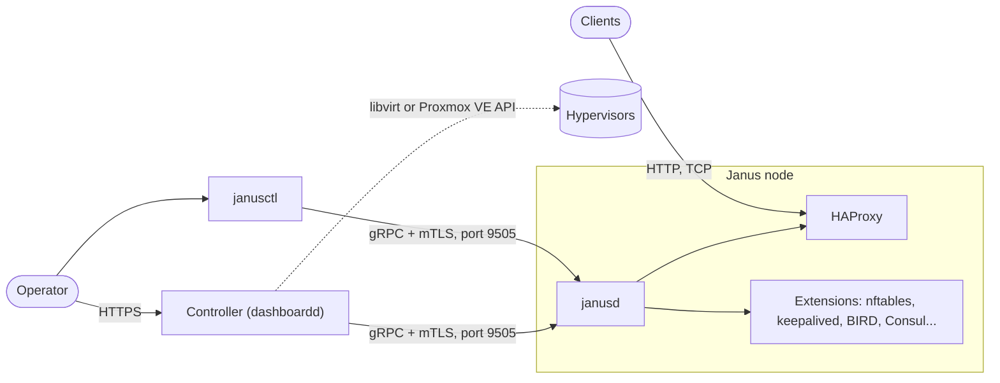

# How Janus works

Janus is a Linux distribution built from scratch around one job: running
HAProxy. Its root filesystem is read-only and verified block by block
(dm-verity), it boots a signed kernel image from one of two slots so an
update can be rolled back, SELinux confines every daemon, and there is
no shell to log into: a single daemon, janusd, serves the node's whole
API over gRPC with mutual TLS.

## In this section

- [Architecture](../architecture.md) - the design: immutability and the
  A/B partition layout, trusted boot, the PKI, SELinux, the no-shell API,
  extensions.
- [The gRPC API](../api-routes.md) - every service and method, and which
  are implemented.
- [Roadmap](../roadmap.md) - how Janus was built, phase by phase, and
  what's planned.
- [The disk image](../../image/disk/README.md), [the ISO
  image](../../image/iso/README.md) and [network
  boot](../../image/pxe/README.md) - how the images are laid out and
  built.
