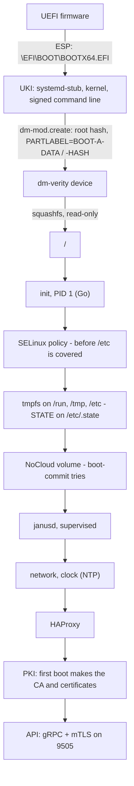
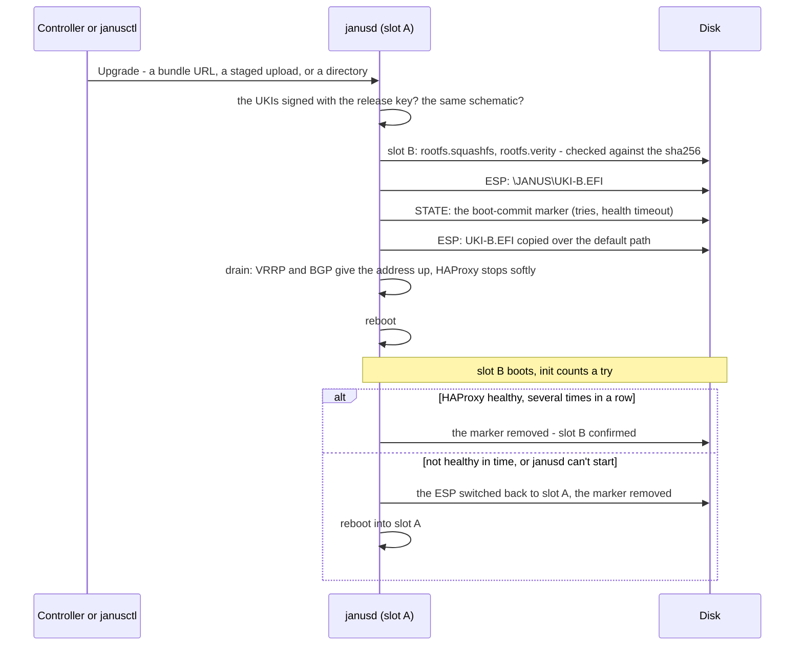

# Boot, disk layout and A/B updates

How a Janus node boots - from the firmware to its API, with nothing
writable on the way that matters - and how an update replaces the whole
system and goes back on its own. The design's reasons:
[architecture](../architecture.md).

## The disk

One GPT disk, the same for every node of a release:

| # | Partition | What |
|---|---|---|
| 1 | ESP (FAT32) | `\EFI\BOOT\BOOTX64.EFI` - the active slot's kernel image, where the firmware looks by default - and `\JANUS\UKI-A.EFI`, `\JANUS\UKI-B.EFI`, both slots' images |
| 2, 3 | `BOOT-A-DATA`, `BOOT-A-HASH` | Slot A: the root filesystem (squashfs) and its dm-verity hash tree |
| 4, 5 | `BOOT-B-DATA`, `BOOT-B-HASH` | Slot B, the same |
| 6 | `STATE` (ext4) | The node's own: its PKI, HAProxy's configuration and files, the network, the Controller, extensions' settings, the boot-commit marker - **shared by both slots**, so an update never touches the configuration |

Partitions are found by their GPT label, never their device name: the
same image boots from virtio, SATA, NVMe or USB. The installer ISO is
laid out differently - the release bundle on an ISO 9660 partition, its
own ESP, and `JANUS-ISO-DATA`/`-HASH` named so an installer never mounts
the slots of a disk it just installed.

## The boot chain

1. **The firmware** boots the default EFI path - the active slot's
   Unified Kernel Image: systemd's stub, the kernel and its command line
   in one PE file, signed with the release key in every release bundle.
   No bootloader, no boot menu to edit.
2. **The kernel** finds what to mount in that command line: a
   `dm-mod.create=` table for dm-verity - the slot's data and hash
   partitions by label, and the root hash - then `root=/dev/dm-0`,
   read-only squashfs. Every block read is checked against the hash
   tree; a changed byte is an I/O error. `enforcing=1` (x86) starts
   SELinux enforcing, and `janus.schematic=` names the image's
   extensions. No initramfs.
3. **init** - a Go program, PID 1 - prepares the system: the SELinux
   policy (before `/etc` is covered), `devtmpfs`, the console mirrored to
   the serial port and the screen, the hardening sysctls, a file limit
   for HAProxy, memory filesystems over `/run`, `/tmp` and `/etc` (with
   HAProxy's bootstrap configuration and the CA bundle carried over),
   STATE on `/etc/.state` with its directories bind-mounted where the
   system expects them, the installer's bundle on the ISO, a NoCloud
   volume read into STATE, and a pending update's boot tries counted.
   Every optional step is non-fatal: a node with a broken extra still
   boots to its API.
4. **janusd**, supervised by init - restarted if it exits - starts the
   network manager and the clock, then **HAProxy**, then the **PKI**: on
   a first boot it makes the node's CA, its server certificate and an
   admin certificate printed on the console once. HAProxy starting
   before the PKI is deliberate: a node serves its traffic even when
   something about its certificates needs attention. Then the API on
   9505, and in the background: confirming a pending update,
   registering with a Controller, the console's banner.

## An update

`LifecycleService.Upgrade` - the Controller's update page, `janusctl
lifecycle upgrade` or Terraform:

- **Checked before anything is written**: the bundle's kernel images
  must be signed with the release certificate built into janusd, and
  their signed command line pins the root filesystem's dm-verity hash -
  so checking the signature authenticates the whole bundle, whatever
  path it came by. An image built for another schematic is refused
  unless the change is meant (`allow_schematic_change`).
- **The marker is written before the switch**, durably (written, synced,
  renamed, the directory synced): a power cut at any point leaves either
  the old slot running, or the new one on trial.
- **Two guards on the new slot**: init counts boot tries - a slot whose
  janusd never comes up is reverted after its tries even if janusd
  can't run - and janusd confirms it only once HAProxy answers healthily,
  several times in a row, within the health timeout.
- **Rollback** is the same switch without a new bundle: the other slot's
  image, still on the ESP, becomes the default again.

## Where the code is

| Step | Package |
|---|---|
| The kernel's command line, the UKI | `image/uki/assemble.sh`, `hack/dm-verity-cmdline.sh` |
| init | `rootfs/init` |
| janusd's start | `cmd/janusd` |
| Upgrade, Rollback, Install | `internal/api/lifecycle.go`, `internal/api/install.go` |
| The release signature | `internal/releasetrust` |
| The ESP switch, the slots | `internal/espswitch`, `internal/bootslot` |
| The boot-commit marker, its revert | `internal/bootcommit`, `internal/bootrevert` |
| The disk layout | `internal/diskimage`, `image/disk/assemble.sh` |
