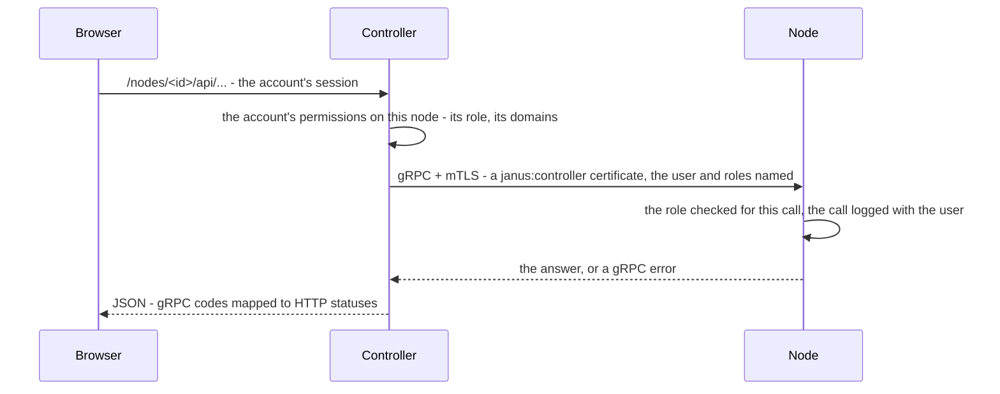

# The Controller, inside

The Controller (`dashboardd`, in `dashboard/`) is one Go binary and a
React frontend built into it: the fleet's pages, its API, its
certificate authority, and - given hypervisors - its nodes' virtual
machines. It's not in the data path: nodes keep serving without it.
Running it: [the Controller](../../dashboard/README.md).

## Two ports

| Port | Serves | TLS |
|---|---|---|
| `:8080` (`-addr`) | The pages - the fleet's, and each node's under `/nodes/<id>/` - and the API, behind an account or an API token | HTTPS only: the Controller's self-signed identity, or a certificate of yours |
| `:8443` (`-register-addr`) | Nodes registering | Always the Controller's own identity - what nodes are provisioned to check - never replaced |

## A node's page

A node's page is a second frontend the Controller serves under
`/nodes/<id>/`; its API calls are relayed to the node over gRPC:

- **One connection per node**, long-lived and shared by every page,
  reconnecting by itself.
- **Streams** - logs, events, packet captures, the console - are
  Server-Sent Events; a node's error mid-stream arrives as a `failure`
  event.
- **The node decides**: the Controller refuses what an account's grants
  exclude before anything leaves, but a role is always the node's own
  check, with the node's own message.

## What it keeps

| What | Where | |
|---|---|---|
| Nodes, pending registrations, labels | `<data-dir>` (`internal/store`, `internal/pending`) | |
| Accounts, MFA, API tokens | `users.json`, `api-tokens.json` | bcrypt passwords; tokens and enrollment tokens as SHA-256 only; TOTP secrets sealed with the master key |
| Sessions | memory | idle 30 minutes, 12 hours at most; ended by a password change |
| The fleet's issuing CA | `<data-dir>`, sealed with the master key | the root's key leaves with the recovery kit |
| Hypervisors, machines | `<data-dir>/hypervisors`, `<data-dir>/machines` | ownership tags on every machine it created |
| The audit log | `audit.jsonl` | every change made through the API |

The master key (`JANUS_CONTROLLER_MASTER_KEY_FILE`) lives outside the
data directory, so a copy of the data alone opens nothing.

## Background work

- **The fleet's trust**: a loop brings every node to trust the fleet,
  checks it with a fleet certificate, then deletes the node's service
  credential - from then on, every call names its user.
- **Releases**: it reads the GitHub releases - each one's
  `security.json` once - to mark the updates that fix something on each
  node (🔒), and asks the image factory for nodes with extensions.
- **Machines**: creating one is a background job - the image, the
  virtual machine, the wait for its registration - with its phase and
  history kept; a restarted Controller says what was interrupted. Each
  machine's record is read back from its node and hypervisor every
  minute, so a change made elsewhere shows.
- **Consoles**: one reader per machine on the hypervisor, private keys
  redacted, fanned out to every page watching it.
- **Backups**: once an admin sets them up, to S3 every 24 hours by
  default - an age-encrypted archive with a signed manifest, the
  Controller's data and each node's configuration read through its API.

## Updating itself

The Controller never touches Docker: a second container from the same
image, `janus-controller-updater`, has the Docker socket and no network,
and does one thing - move the Controller's Compose service to a
release's image, backing up the data first and rolling back if the new
version doesn't come up ([updating the
Controller](../../dashboard/README.md#updating-the-controller)).

## Where the code is

| What | Package |
|---|---|
| The HTTP server, routes, gates | `dashboard/backend` (`main.go`, `auth_handlers.go`, `node_pages.go`) |
| The relay to nodes | `dashboard/backend/internal/nodeproxy` |
| Accounts, MFA, tokens | `dashboard/backend/internal/auth` |
| The fleet | `dashboard/backend/internal/fleet`, `internal/secrets` |
| Hypervisors, machines | `dashboard/backend/internal/hypervisor`, `internal/machines` |
| Backups | `dashboard/backend/internal/backup`, `internal/s3` |
| The updater | `dashboard/updater` |
| The frontend | `dashboard/frontend` - its design rules: [Controller UI design](../controller-ui.md) |
