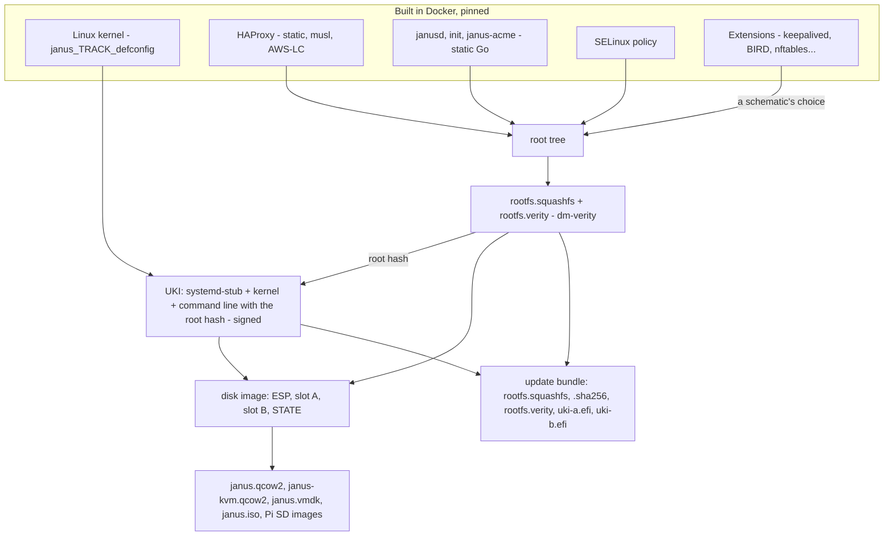

# How an image is built

A Janus image is built from source, LFS-style, by an ordinary toolchain -
Docker, Go, the kernel's own build - none of which ships in the image:
the node only ever receives built bytes. Every upstream is pinned
(`versions.mk`, base images by digest), and no step needs root or a loop
device, so the self-hosted runners build it unprivileged.

## The pieces

| Piece | Built by | Notes |
|---|---|---|
| The kernel | `make kernel-build` (`kernel/`) | One per kernel track (`variants.mk`): `kernel/configs/janus_<track>_defconfig`, made with `make kernel-menuconfig KERNEL_TRACK=<track>`, never hand-edited, every track's saying what the others' say (`go test ./hack/kconfig`): KSPP hardening, SELinux, dm-verity, nf_tables, the drivers bare metal needs - no firmware files. `kernel/built-files-<track>-*.txt` list what each build reads, for the vulnerability checks |
| HAProxy | `make haproxy-build` (`pkgs/haproxy`) | One per LTS branch (`variants.mk`, `make haproxy-build-<branch>`), laid onto the base tree as a layer of its own. Static, against musl and [AWS-LC](../haproxy-config.md#tls-aws-lc) built from source, with its Prometheus exporter; no PCRE2, no Lua |
| janusd, init, janus-acme | `make build`, statically | No C library anywhere in the base system: Go is static |
| The SELinux policy | `make selinux-policy` (`selinux/`) | Monolithic, hand-written: a domain per daemon, every rule from a real denial |
| Extensions | `make extensions-amd64` (`extensions/<name>/`) | A manifest and a Dockerfile each, packed into a tar layered onto the root tree - never replacing a file |
| The root filesystem | `rootfs/assemble.sh` | squashfs and its dm-verity hash tree (`veritysetup format`). The SELinux labels of the executables and `/var/empty`'s mode go in as mksquashfs pseudo-files: no root needed |
| The kernel image (UKI) | `image/uki/assemble.sh` | `ukify`, with systemd's stub from a pinned Debian - never the build host's. The command line: the dm-verity table with its root hash, `enforcing=1`, the consoles, `ipv6.disable_ipv6=1` (init turns IPv6 on once hardened), `janus.schematic=`. Signed when the release key is given |
| The disk | `image/disk/assemble.sh` | `sgdisk`, `mtools`, `dd seek=`, `debugfs` - no `mount`, no loop device. Both slots, the ESP with both UKIs, an empty STATE |
| The formats | `image/{kvm-proxmox,kvm,vmware,iso,rpi-uefi}` | `qemu-img` for qcow2 and VMDK; `xorriso` for the hybrid installer ISO, with the release bundle inside |
| The update bundle | `image/release/assemble.sh` | Exactly these names - `rootfs.squashfs`, `.sha256`, `rootfs.verity`, `uki-a.efi`, `uki-b.efi` - which an upgrade fetches under a base URL |

## Signing

The release key signs the UKIs of the release bundle - and the bundle is
built only once, in the publishing job, since mksquashfs isn't
byte-reproducible: another build's UKIs would carry another root hash.
The private key lives only in a CI secret, used on the publishing runner
and verified (`sbverify`) against the committed certificate,
[`image/secureboot/production-cert.pem`](../../image/secureboot/production-cert.pem),
before anything is published; janusd carries a copy of that certificate
to check every update. A schematic's images are signed the same way, on
the same runner.

## Images with extensions

Every release also publishes what its images are made of - the kernel,
the base root tree, each extension's tar and the catalog of extensions -
so an image with extensions is assembled from those, never compiled
again: `rootfs/assemble-from-base.sh` layers the extensions onto the
base tree, then the same squashfs, UKI and disk steps. The image
factory runs it on demand (`schematic-build.yml`), and
`image/schematic/build.sh` does it locally
([images and extensions](../image-factory.md#how-a-custom-image-is-built)).

## Proven before it's published

`image-build.yml`, on the self-hosted runners, dispatched by hand:

- **The boot chain**: QEMU with OVMF, SELinux enforcing - dm-verity,
  A/B, Secure Boot, the ISO, PXE, bare-metal hardware.
- **Lifecycle**: install, upgrades by every path, rollbacks, the
  automatic revert.
- **Features**: the API, the network, the firewall, VRRP, BGP, Let's
  Encrypt, Consul, metrics, packet captures, the Controller, the
  hypervisors, Terraform.
- **Then publish**: the images as workflow artifacts, the Controller's
  image to Docker Hub, and - for a release - the GitHub release, its
  signed bundle, `janusctl` packages, the Terraform provider, the
  security notes and the SBOM.

Every test, and how to run one: [testing](../contributing/testing.md).
