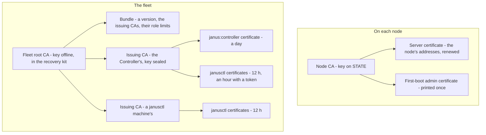

# Trust and certificates

Every call to a node is a TLS connection both sides authenticate, and
every certificate on either side traces back to one of two roots: the
node's own CA, or its fleet's. This page is the map; the full design -
rotation, the Controller's fleet, accounts and roles - is in the
[architecture](../architecture.md#mtls--pki).

## Who signs what

| Certificate | Signed by | Lifetime | Used for |
|---|---|---|---|
| Node CA | itself | 10 years | Signing what the node itself issues |
| Server certificate | the node CA | renewed 30 days before expiry; reissued when the addresses or hostname change | The node's API (9505) |
| First-boot admin | the node CA | a year | The way in when nothing else works |
| Fleet root | itself | 20 years | Signing issuing CAs and bundles; its key never online |
| Issuing CA | the fleet root | 2 years | Signing clients' certificates - the Controller's, or one per janusctl machine |
| `janus:controller` | the Controller's issuing CA | a day | The Controller's calls, each made for a named user |
| janusctl's | an issuing CA | 12 hours (an hour with an API token) | `janusctl` reaching nodes directly |

## What a node accepts

A client certificate opens a node if it chains to:

- **the node's own CA** - always, and only it can make the node forget
  its fleet; or
- **the fleet's root**, through the root itself or an issuing CA that the
  newest **bundle** - signed by the root, each one newer than the last -
  lists. An issuing CA can be limited to a role: one that may only
  sign `os:reader` certificates can't let anyone in as an admin.

The role is in the certificate - `os:admin`, `os:operator`, `os:reader`
in its Organization - and every API call names the role it needs. A
`janus:controller` certificate acts for the user the Controller names
with each call, with that user's role; a **scoped** certificate carries
a role per node - each node found by its CA's key - and the node
applies the one for itself. Every change is
logged on the node with who made it.

The node's TLS configuration is built per connection: a new bundle
counts from the next connection.

## Getting a node into the fleet

- **Registration with a Controller**: the node announces its CA's
  certificate - never a key - and, once admitted, takes the fleet's
  trust: the root, then the bundle.
- **Without a Controller**: `janusctl fleet adopt` sets the fleet on a
  node, using its first-boot credential or the CA fingerprint its
  console printed ([a fleet without a Controller](../fleet-without-controller.md)).
- **From the first boot**: the fleet's root and bundle given on the
  installer, a seeded image or NoCloud.

The Controller never holds a node's admin credential, and a node never
sends its own anywhere.

## Algorithms

ECDSA P-256 for every key - nodes, fleet, Controller, clients: what every
browser and TLS stack accepts (Ed25519 broke Chromium's handshakes with
the Controller's pages).

## Where the code is

| What | Package |
|---|---|
| The node's CA, certificates, rotation | `internal/pki` (`rotate.go`, `servercert.go`) |
| The fleet: pinning, bundles, chains | `internal/pki/fleet.go`, `internal/api/access.go` |
| Scoped certificates | `internal/pki/scope.go` |
| Roles per call | `internal/api/authz.go`, `internal/rbac` |
| The Controller's fleet | `dashboard/backend/internal/fleet` |
| janusctl's fleet | `cmd/janusctl/fleet.go`, `internal/fleetkit` |
