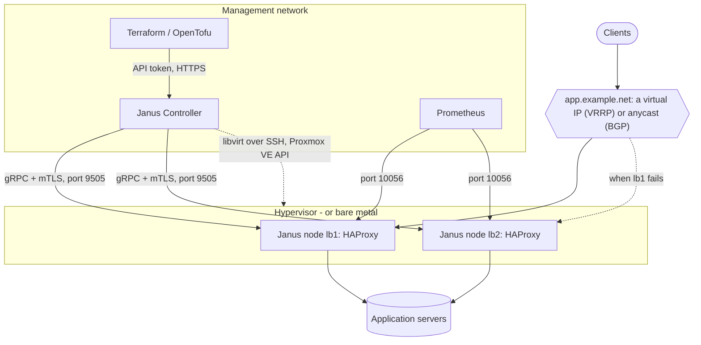

# Janus in a private cloud

Janus nodes are virtual machines like any other - an image to import, a
first boot that gives the node its identity and its network - with
one difference that shapes everything here: there is no shell to log
into. A node is configured through its API, by the Controller,
`janusctl` or Terraform, and an integration automates those, never a
login. This section is for platform engineers bringing Janus into a
private cloud: on libvirt/KVM, Proxmox VE, VMware or bare metal.

## The pieces

| | |
|---|---|
| [Images and formats](images.md) | What each release publishes - qcow2, VMDK, ISO - which one each platform takes, the extensions, checking what you download |
| [First boot](first-boot.md) | How a node gets its Controller, its network and its admission on its first boot - NoCloud, a seeded image, the installer - and its HAProxy configuration after |
| [Automated deployment](automation.md) | Terraform and OpenTofu, the Controller's API, `janusctl` in a pipeline, enrollment tokens for batches |
| [Networking](networking.md) | Virtual IPs (VRRP), anycast (BGP), segmentation, the ports a node and the Controller use, DNS - and a request's path through a node |
| [Observability](observability.md) | Prometheus - Janus's exporter, node_exporter, HAProxy's own - alerts, logs, packet captures |
| [Lifecycle](lifecycle.md) | Updates with an automatic revert, rollbacks, scaling, the Controller's own updates and backups |
| [Security](security.md) | What protects a node, the secrets of a deployment and who holds them, certificates, what to expose |

And one end-to-end guide per platform, each with a complete example:

| Platform | Image | Nodes created by | Proven by |
|---|---|---|---|
| [libvirt/KVM](platforms/kvm-libvirt.md) | `janus-kvm.qcow2` | the Controller, over SSH - Terraform drives it | `make terraform-provider-test` applies the example as written, on a real libvirt host |
| [Proxmox VE](platforms/proxmox.md) | `janus.qcow2` | the Controller, through Proxmox's API - Terraform drives it | a real Proxmox VE 9.2 node |
| [Bare metal](platforms/bare-metal.md) | `janus.iso` | the installer, driven by `janusctl` | `make qemu-iso-install-test`, `make qemu-baremetal-test` (UEFI; NVMe, SATA, USB and virtio-scsi disks; Intel NICs) |
| [VMware vSphere](platforms/vmware.md) | `janus.vmdk` | hand or `govc` | QEMU with VMware's devices (pvscsi, vmxnet3) - not yet a real ESXi host |

## A typical deployment

- **Two nodes or more**, so one can be updated, rebooted or lost
  without an outage: a virtual IP moves between them with VRRP
  (keepalived), or each announces an anycast address with BGP (BIRD).
  Both follow HAProxy's health, and a node about to stop gives its
  traffic up first ([networking](networking.md)).
- **The Controller** holds the fleet: its accounts, the fleet's
  certificate authority, the nodes' updates, and - given a hypervisor -
  the nodes' virtual machines. It isn't in the data path: nodes keep
  serving while it's down.
- **A management network** for the nodes' API (9505), metrics (10056)
  and the Controller - away from the clients' network
  ([segmentation](networking.md#segmentation)).
- **Everything as code**: Terraform creates the nodes and their HAProxy
  configuration through the Controller; the node configurations
  Terraform doesn't cover yet - VRRP, BGP, the firewall - go through
  `janusctl` or the Controller's API, both scriptable
  ([automation](automation.md)).
