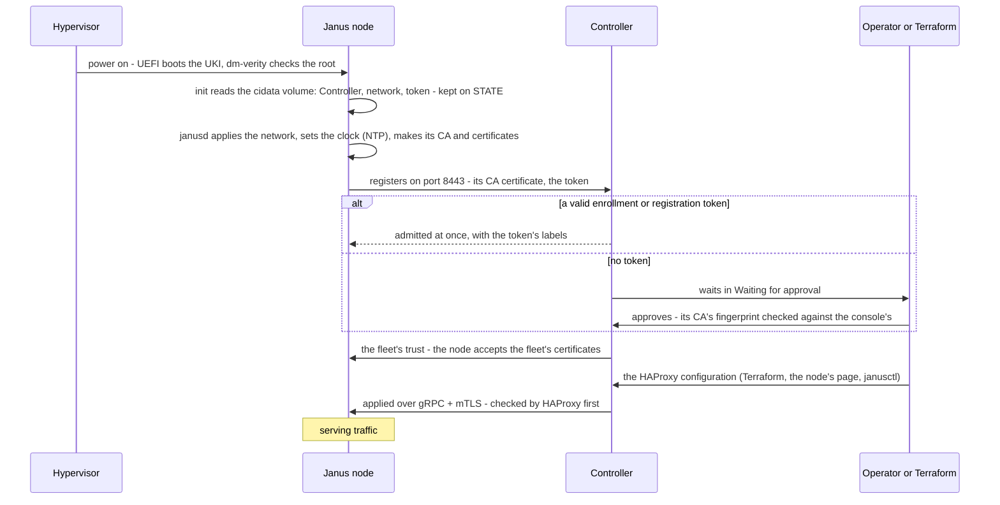

# First boot

A node's first boot gives it everything it is: its certificates, made
on the node and never leaving it; its network; the Controller it
registers with - and, once admitted, the fleet it trusts. What it needs
to know comes from one of three places, read once, kept on its STATE
partition:

| Way | How | Best for |
|---|---|---|
| **A NoCloud volume** | A small `cidata` disk or CD-ROM next to the system disk, with Janus's JSON in `user-data` | Clouds and Terraform: the image stays untouched and shared; what the Controller does on its hypervisors |
| **A seeded image** | `janusctl image seed-controller` / `seed-network` write into a copy of the image, offline | Several nodes cloned from one prepared image |
| **The installer** | `janusctl lifecycle install` with the Controller and the network, on a machine booted from the ISO | Bare metal |

The details of each: [provisioning a node](../provisioning-a-node.md).
A node's HAProxy configuration isn't part of it: it's applied once the
node is admitted, through its API (below).

## What happens



1. **The node's identity is made on the node.** Its certificate
   authority, its API's server certificate and an admin certificate are
   created on the first boot, on STATE. The admin certificate and key
   are printed on the console **once** - the way in when nothing else
   works: keep them somewhere safe, or let them go, since the fleet's
   certificates replace them for everyday use.
2. **The network comes first**: a static configuration from the
   volume, or the kernel's DHCP lease. Prefer static addresses: the
   lease is taken once at boot and never renewed
   ([network configuration](../network-configuration.md)).
3. **Registration**: the node announces itself to the Controller's
   registration port (8443), checking the Controller's certificate
   against the CA it was given - never trusting on first use. A node
   that can't reach it keeps trying, waiting longer each time up to two
   minutes, and says why on its console (`selfregister: ... - retrying
   in ...`); the Controller shows that line on the machine it created.
4. **Admission**: a valid token admits the node at once - a machine the
   Controller created has a one-time token, a batch of bare-metal
   machines can share an **enrollment token** (a number of uses, an
   expiry, labels). Without one, the node waits for an admin's approval
   on the Controller, which shows the fingerprint of the node's CA:
   compare it with the one the node's console printed.
5. **Trust**: once admitted, the node trusts the fleet's certificate
   authority, and the Controller - and `janusctl` with a fleet
   certificate - reaches it from then on.

## The NoCloud volume

At boot, `init` scans the attached disks and CD-ROM drives - virtio,
SCSI, SATA, USB, NVMe - for a volume labelled `cidata` (or `CIDATA`),
ISO 9660 or FAT: cloud-init's NoCloud convention, so whatever already
makes cloud-init volumes for your other VMs can make this one. **Its
content isn't cloud-init's**: no `#cloud-config`, no `write_files` - one
JSON object in `user-data`.

```json title="examples/nocloud/user-data.json"
{
  "controller_address": "controller.example.net:8443",
  "controller_ca_cert": "-----BEGIN CERTIFICATE-----\nMIIB... the Controller's CA certificate, from its Provision panel ...\n-----END CERTIFICATE-----\n",
  "registration_token": "janus-enroll_<id>_<secret>",
  "network": {
    "hostname": "lb1",
    "interfaces": [
      {"name": "front", "mac": "52:54:00:00:20:21", "mode": "ADDRESSING_MODE_STATIC", "addresses": ["192.0.2.21/24"], "gateway": "192.0.2.1"}
    ],
    "dns": {"servers": ["192.0.2.53"]}
  }
}
```

| Key | What | |
|---|---|---|
| `controller_address` | The Controller's registration address, `host:port` (port 8443 by default) | With `controller_ca_cert`: one is useless without the other |
| `controller_ca_cert` | The Controller's certificate (PEM), its **Provision new nodes** panel's | What the node checks the Controller against |
| `controller_fleet_root_cert` | The fleet's root certificate (PEM), once the Controller's fleet is set up | Checked first, before `controller_ca_cert` |
| `registration_token` | An enrollment token, or a machine's one-time token | Admits the node without approval; needs `controller_address` |
| `network` | A [network configuration](../network-configuration.md) - hostname, interfaces, VLANs, DNS, NTP | Applied from the first boot |
| `fleet_root_cert`, `fleet_bundle` | A fleet `janusctl` keeps, without a Controller | [A fleet without a Controller](../fleet-without-controller.md) |

- A node keeps what it was given: a later boot's volume never
  overwrites a configuration it already has.
- A volume the node can't use - a network configuration it would
  refuse, a Controller address without its CA - is ignored as a whole,
  and the console says why (`init: nocloud: read ...`).
- `meta-data` may instead point at a URL holding the `user-data`
  (`seedfrom`), checked against a CA you give, the system's trust store,
  or not at all for plain HTTP
  ([remote retrieval](../provisioning-a-node.md#remote-retrieval-seedfrom)).

Making one, from a directory holding `user-data`:

```sh
# An ISO 9660 volume - a CD-ROM, like Proxmox's cloud-init drive:
xorriso -as mkisofs -V cidata -J -r -o cidata.iso seed/
# Or FAT, as an extra disk:
truncate -s 1M cidata.img && mkfs.vfat -n cidata cidata.img && mcopy -i cidata.img seed/user-data ::user-data
```

The Controller's **Provision new nodes** panel gives the volume's
`user-data` for its own address, CA and fleet; a machine it creates on a
hypervisor gets a volume it makes itself.

## The HAProxy configuration

A node boots with a minimal HAProxy configuration - a health answer on
port 8080 - and gets its real one through its API once it's admitted:

- **Terraform**: `janus_haproxy_config` ([Terraform](../terraform.md)),
  which the platform guides' examples use;
- **the Controller**: the node's **Apps › HAProxy › Configuration**
  page - validate, diff, apply;
- **`janusctl`**: `janusctl -n lb1 haproxy apply-config haproxy.cfg`.

Every one has HAProxy check the configuration first (`haproxy -c`, then
a real start): a configuration it refuses changes nothing, and an
accepted one is taken over by a new HAProxy process without dropping
connections. The configuration is kept on the node across reboots and
updates. What changes from a distribution's `haproxy.cfg`: [your
haproxy.cfg](../haproxy-config.md).
