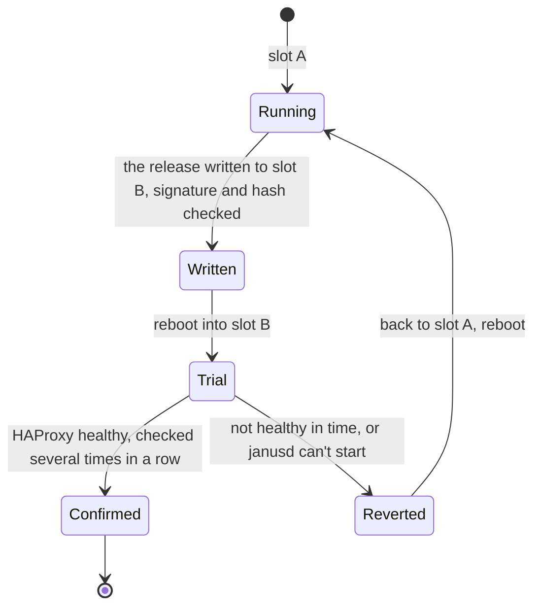

# Lifecycle

A node is never patched in place: an update replaces its whole system
with the next release's, verified, and keeps its configuration. This
page covers updating nodes and the Controller, going back, and growing
or shrinking a fleet.

## Updating a node

Every node has two system slots. An update is written to the one not
running, checked, and booted; the node then confirms itself healthy, or
goes back on its own:



- **How it reboots**: through the firmware by default - a server's
  POST included. `reboot_mode: KEXEC` jumps from the running kernel
  into the new release's, in seconds; it keeps the firmware's rule
  (with Secure Boot on, only a signed release) and falls back to the
  firmware, saying so, when it can't. A revert always goes through the
  firmware.
- **What's kept**: STATE - the node's identity, its HAProxy, network,
  firewall, VRRP and BGP configurations, its certificates - is shared by
  both slots. An update changes the system, never the configuration.
- **What's checked**: the release's kernel images must be signed with
  the Janus release key, and its root filesystem match the hash they
  carry; an image built for other extensions (another schematic) is
  refused unless the change is meant.
- **The automatic revert** - `-wait-for-health` with `janusctl`, on by
  default on the Controller - watches HAProxy after the reboot: a
  configuration the new HAProxy refuses, or any reason it doesn't come
  up, sends the node back to the previous release by itself.
- **The traffic moves first**: before the reboot, HAProxy stops being
  healthy for VRRP and BGP, the virtual IP or the anycast route moves to
  another node, and HAProxy keeps its connections two more seconds.
  Update the nodes of a pair one at a time.

From the Controller, a node's **System › Update** page offers the newest
release - built for the node's extensions by the image factory when it
has any - and installs it, the node downloading it, or through the
Controller for a node that can't reach the internet. Its card says when
an update fixes a vulnerability (🔒). With `janusctl`:

```sh
v=v2026.10.05-5
janusctl -n lb1 lifecycle upgrade -wait-for-health \
  https://github.com/swenske/Janus/releases/download/$v/
janusctl -n lb1 version                     # the release, the slot, the schematic
```

The node fetches the bundle from that base URL itself; with no route to
it, `janusctl lifecycle upload-release` streams the files to the node
from where `janusctl` runs, and `upgrade` then takes the staging
directory it prints. Terraform: change a node's `version` (or `extensions`), and
`apply` runs the same update.

## Going back

`janusctl -n lb1 lifecycle rollback` boots the other slot: the previous
release, with the same configuration. Nothing to re-apply.

## The Controller

- **Updating it**: the Controller says when a newer release exists; with
  its updater running next to it (the Compose setup), one click installs
  it - and if the new version doesn't come up within two minutes, the
  previous one is put back, with its data
  ([updating the Controller](../../dashboard/README.md#updating-the-controller)).
  Nodes keep running throughout: the Controller isn't in their data
  path.
- **Backing it up**: once a day by default, to an S3 bucket - accounts,
  the fleet, nodes and machines, and each node's configuration -
  encrypted to a key the Controller doesn't keep. A new Controller
  restored from a backup is the same Controller to its nodes
  ([backups](../../dashboard/README.md#backups)).

## Growing and shrinking

- **More nodes**: Terraform - another entry in the example's `nodes`
  map - or **Create node** on a hypervisor; bare-metal machines with an
  enrollment token, admitted on their first boot
  ([automation](automation.md)). A new node needs its HAProxy
  configuration (Terraform applies it) and, in a VRRP group or a BGP
  anycast set, its keepalived or BIRD configuration (`janusctl network
  vrrp apply`, `bgp apply`).
- **Fewer**: destroying a node stops it cleanly first - HAProxy stops,
  VRRP and BGP peers see it go - before its virtual machine is deleted
  and the Controller forgets it.
- **Bigger**: vCPUs and memory change in place - a clean restart of the
  node, its configuration kept.

## Release cadence and support

Releases are frequent, dated (`vYYYY.MM.DD`, `-2`, `-3` for more the
same day) and cumulative: only the latest one is supported, and a
release that fixes a vulnerability says so in its name and its notes
(`🔒`) - see the [security policy](../../SECURITY.md).
