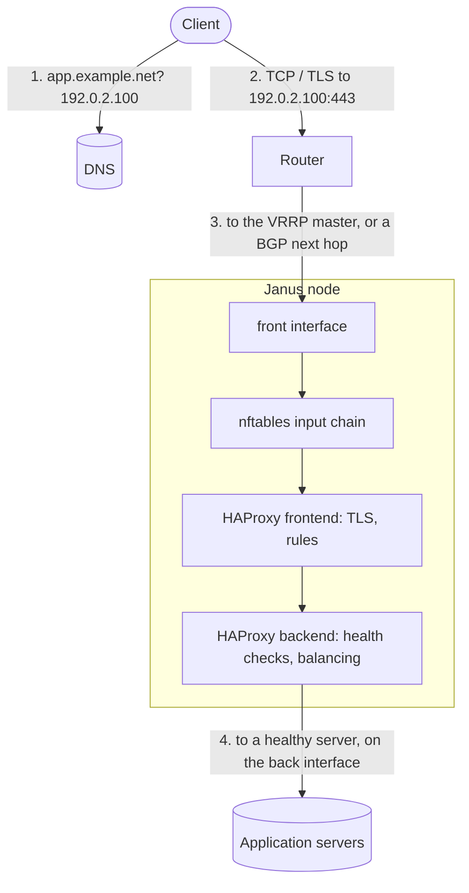

# Networking

A Janus node is a load balancer: its network is where it matters most.
This page puts together how a node's interfaces, addresses and
redundancy fit a private cloud's network - each mechanism has its own
page for the details.

## A client request's path



1. **DNS** gives the service's virtual IP, the same whichever node
   serves it.
2. **The router** delivers it to the node that holds the IP: with VRRP,
   the master, which answers ARP for it; with BGP, any node announcing
   it, equal-cost paths spreading the flows across them.
3. **nftables** - with the [firewall](../firewall.md) extension -
   filters what reaches the node.
4. **HAProxy** terminates TLS, applies its rules, and sends the request
   to a healthy server - its health checks decide which.

## Keeping the address up

Two or more nodes serve the same address, and both mechanisms follow
HAProxy itself, not just the node: a node whose HAProxy stops answering
gives the address up. A node about to stop on purpose - a reboot, an
update, a rollback, HAProxy stopped - gives it up first, then keeps its
listeners open for two seconds before HAProxy stops: a rolling update
drops no connection and needs no manual step.

| | VRRP (keepalived) | BGP anycast (BIRD) |
|---|---|---|
| The extension | `keepalived` | `bird` |
| How | One node holds the virtual IP; another takes it over when the holder fails, or its HAProxy does | Every node announces the address to the routers; one that fails, or whose HAProxy does, withdraws it |
| Traffic | Active/standby, per virtual IP (several IPs spread the load) | Active/active: the routers spread flows (ECMP) |
| Network | The nodes share a layer-2 segment with the clients' gateway | Routers speaking BGP, any topology |
| Failover | About 0.5 s (VRRPv3, 0.2 s adverts) | The BGP session's hold timer, or BFD's milliseconds |
| Firewall | `ip protocol 112 accept` | `tcp dport 179 accept` (and BFD, UDP 3784-3785) |
| Details | [VRRP](../vrrp.md) | [BGP](../bgp.md) |

A VRRP pair, in short - the same file on both nodes but for its
`priority`, applied with `janusctl -n lb1 network vrrp apply ...`:

```text
track_file haproxy {
    file /run/janus/keepalived/haproxy-health     # kept by janusd
}

vrrp_instance front {
    state BACKUP
    interface front
    virtual_router_id 51
    priority 150                                  # 100 on lb2
    advert_int 0.2
    track_file {
        haproxy weight -100                       # HAProxy down: the other node takes over
    }
    virtual_ipaddress {
        192.0.2.100/24
    }
}
```

## Segmentation

A node's network is one document - interfaces matched by MAC address,
802.1Q VLANs, static addresses, routes' metrics, DNS, NTP
([network configuration](../network-configuration.md)). A common layout
separates three networks:

| Network | Carries | On the node |
|---|---|---|
| **Management** | The node's API (9505) from the Controller and admins, metrics (10056, 9100) to Prometheus, registration to the Controller (8443) | `mgmt` |
| **Front** | Clients, and the virtual IP or anycast address | `front`, with the default gateway |
| **Back** | HAProxy to the application servers | `back` |

As VLANs on one trunk:

```json title="examples/network/vlans.json"
{
  "hostname": "lb1",
  "interfaces": [
    {"name": "trunk", "mac": "52:54:00:00:10:21", "mode": "ADDRESSING_MODE_NONE"},
    {"name": "mgmt", "vlan": {"parent": "trunk", "id": 10}, "mode": "ADDRESSING_MODE_STATIC", "addresses": ["10.0.0.21/24"]},
    {"name": "front", "vlan": {"parent": "trunk", "id": 20}, "mode": "ADDRESSING_MODE_STATIC", "addresses": ["192.0.2.21/24"], "gateway": "192.0.2.1"},
    {"name": "back", "vlan": {"parent": "trunk", "id": 30}, "mode": "ADDRESSING_MODE_STATIC", "addresses": ["10.0.10.21/24"]}
  ],
  "dns": {"servers": ["10.0.0.53"]},
  "ntp": {"servers": ["10.0.0.1"]}
}
```

Or as separate interfaces - a virtual machine's NICs on separate
networks, each matched by its MAC:

```json title="examples/network/two-interfaces.json"
{
  "hostname": "lb1",
  "interfaces": [
    {"name": "mgmt", "mac": "52:54:00:00:10:21", "mode": "ADDRESSING_MODE_STATIC", "addresses": ["10.0.0.21/24"]},
    {"name": "front", "mac": "52:54:00:00:20:21", "mode": "ADDRESSING_MODE_STATIC", "addresses": ["192.0.2.21/24"], "gateway": "192.0.2.1"}
  ],
  "dns": {"servers": ["10.0.0.53"], "search": ["example.net"]},
  "ntp": {"servers": ["10.0.0.1"]}
}
```

A change is applied **on trial**: the node switches at once, and
reverts by itself unless the change is confirmed over a connection that
still reaches it - a mistake can't strand a node you can't log into.

Then the [firewall](../firewall.md) keeps each network to its purpose -
the API and metrics on the management interface only, say:

```nft
iifname "mgmt" tcp dport { 9505, 10056 } accept comment "API and metrics: management only"
```

## Ports

A node:

| Port | Who reaches it | What |
|---|---|---|
| 9505/tcp | The Controller, admins (`janusctl`) | The node's API: gRPC with mutual TLS, every call's role checked |
| 10056/tcp | Prometheus | The Janus exporter - plain HTTP, no authentication: restrict it |
| 9100/tcp | Prometheus | node_exporter, with its extension - plain HTTP, no authentication |
| 8080/tcp | - | The first boot's HAProxy answers there until your configuration replaces it |
| Your frontends' | Clients | HAProxy |
| IP protocol 112 | The other VRRP nodes | VRRP, with keepalived |
| 179/tcp, 3784-3785/udp | The routers | BGP and BFD, with BIRD |
| 8301/tcp+udp | The Consul cluster | Consul's gossip, with its extension (and 8300/tcp to the servers) |

A node reaches: the Controller's registration port (8443) until it's
admitted, its DNS and NTP servers, and - for an update it downloads
itself - GitHub or the image factory. An update can also come through
the Controller instead ([lifecycle](lifecycle.md)).

The Controller:

| Port | Who reaches it | What |
|---|---|---|
| 8080/tcp (often 443) | Admins' browsers, `janusctl`, Terraform | Its pages and API, HTTPS only |
| 8443/tcp | Nodes | Registration |

It reaches: every node's 9505, its hypervisors (SSH for libvirt,
8006/tcp for Proxmox VE), GitHub and the image factory for releases and
updates, and its backup bucket.

## DNS

- **The service's name** points at the virtual IP or the anycast
  address: clients never need to know which node serves them.
- **The nodes' own resolvers** - from their network configuration, or
  DHCP's - resolve the backend servers' names when HAProxy starts; a
  `resolvers` section re-resolves them at runtime, which is how a
  backend follows Consul's catalog (`127.0.0.1:8600`, with the
  [consul](../consul.md) extension).
- **The Controller's name** is what nodes register to: give it a stable
  name, and the Controller a certificate for it - or provision nodes
  with its address.

## In front of, or behind, another load balancer

Janus is usually the edge: clients reach its virtual IP directly. Behind
another load balancer - a cloud's, a router's ECMP - HAProxy keeps the
client's address with the PROXY protocol (`accept-proxy` on Janus's
`bind`, when the load balancer in front sends it), and in front of
other proxies sends it with `send-proxy` on a `server` line.
