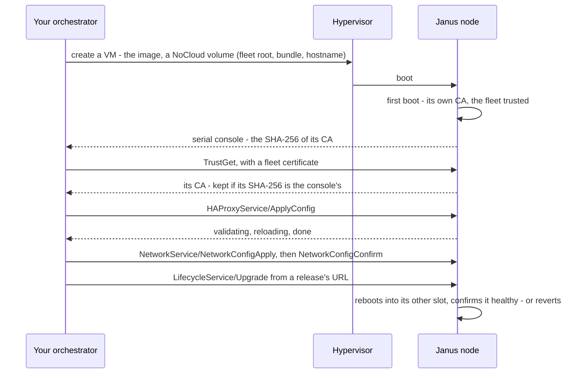

# Your own orchestrator

A private cloud that has its own orchestration can drive Janus nodes
without the Controller: what the Controller does that your orchestrator
takes over, and the contracts a node offers it - in any language.

The Controller is one client of the nodes among others: everything it
does goes through what a node offers anyone - an image, a NoCloud
volume, a console, a gRPC API over mutual TLS, X.509 certificates. An
orchestrator written in Go, Java, Python or anything else does the same
with nothing of Janus's code: these pages specify each contract, and a
[complete example](#the-example) - shell scripts, `openssl`, `jq`,
`grpcurl` and a small registration endpoint in Python - drives real
nodes on every image build.

## What the Controller does, and what replaces it

| The Controller... | What a node offers your orchestrator | Where |
|---|---|---|
| holds the fleet's certificate authority and issues certificates | a fleet: a root it pins, a bundle the root signs, client certificates with their role in them - `openssl` makes them, or any PKI that meets the profile | [Certificates and the fleet](orchestrator-certificates.md) |
| creates nodes on a hypervisor | an image, and a NoCloud volume for its first boot - your orchestrator already creates virtual machines | [Images](images.md), [first contact](first-contact.md) |
| learns new nodes and comes to trust them | its CA's fingerprint on its serial console - or the node announces itself to an HTTPS endpoint you serve | [First contact](first-contact.md) |
| configures nodes, acts for its users with their roles | the gRPC API - `.proto` files, mutual TLS, a role checked on every call | [Driving nodes](driving-nodes.md), [API reference](api-reference.md) |
| updates nodes | an update from a URL, with an automatic revert | [Driving nodes](driving-nodes.md#updates) |
| watches nodes | Prometheus metrics, an event stream | [Observability](observability.md) |
| has accounts, MFA, an audit log, backups, a UI | nothing on the node: your platform's own | - |

What a node keeps doing by itself, whoever drives it: checking every
configuration before applying it, reverting a network change nobody
confirms and an update that doesn't come up healthy, renewing its own
server certificate, logging who changed what.

## The life of a node

A node that your orchestrator didn't create - a bare-metal machine, a
VM someone else made - announces itself instead, to a registration
endpoint your orchestrator serves ([first contact](first-contact.md#the-node-announces-itself)).

## Nothing to link against

| Contract | Specified by | Read with |
|---|---|---|
| The node's API | the `.proto` files in `api/proto/janus/v1alpha1`, at the release your nodes run | any gRPC implementation: generate the stubs for your language with `protoc` or `buf`; `grpcurl` for scripts |
| Who may call it | X.509 client certificates: the role in the subject's Organization | any TLS 1.3 client |
| The fleet's trust | a JSON bundle signed with ECDSA over SHA-256 | `openssl`, an HSM, a KMS |
| First contact | a line on the serial console; or JSON over HTTPS | your hypervisor's console; any HTTPS server |
| First boot | a JSON `user-data` on a `cidata` volume | any ISO 9660 tool |
| Metrics | Prometheus' text format over HTTP | Prometheus |

Janus's own Go packages (`internal/...`) can't be imported from another
module, and needn't be: each page states its contract fully.

## The example

[`examples/orchestrator/`](../../examples/orchestrator/) is an
orchestrator cut down to its contracts, one script per step - each shown
and explained where its contract is:

| Script | Does | Page |
|---|---|---|
| `fleet.sh` | the fleet: its root, an issuing CA, the signed bundle | [Certificates and the fleet](orchestrator-certificates.md#the-fleet) |
| `client-cert.sh`, `sign.sh` | a client certificate with its role | [Certificates and the fleet](orchestrator-certificates.md#client-certificates) |
| `user-data.sh`, `cidata.sh` | a node's NoCloud volume | [First contact](first-contact.md#a-node-you-create) |
| `first-contact.sh` | a created node's CA, pinned from its console | [First contact](first-contact.md#a-node-you-create) |
| `registration-cert.sh`, `registration-server.py` | the endpoint nodes announce themselves to | [First contact](first-contact.md#the-node-announces-itself) |
| `janus.sh` | one API call - `grpcurl` with the right certificates | [Driving nodes](driving-nodes.md#calling-a-node) |
| `haproxy-apply.sh`, `network-apply.sh`, `upgrade.sh` | the changes that need care | [Driving nodes](driving-nodes.md#changing-a-node-safely) |

`make qemu-orchestrator-test` runs them as written on every image build,
against three real nodes - SELinux enforcing, no Controller, no
`janusctl`: a node created with its fleet and pinned from its console, a
node admitted on its token, a node approved by hand; configurations
applied and refused, a user's call refused by the node, a network change
confirmed, an update to the other slot.

## Stability

Janus is alpha, and its API is `v1alpha1`: a release may change a
message or a call, and there's no compatibility promise yet. What an
integration can count on today:

- **The `.proto` files are versioned with each release**: generate your
  stubs from the tag your nodes run, and update them with the nodes.
- **Each release's notes say what changed** - in the API too.
- **The contracts on these pages are tested**: the console line, the
  registration protocol, the bundle format and the certificate profile
  are what `make qemu-orchestrator-test` and the nodes' own tests
  check, so a change to one fails them before it ships.
